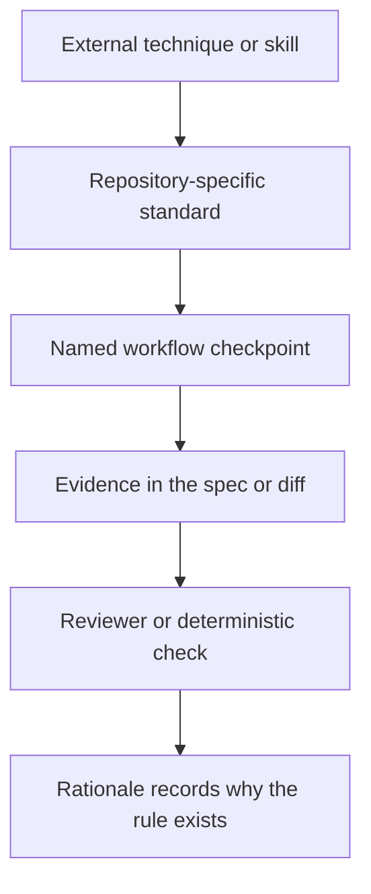

# Pattern: turn engineering principles into agent-enforced standards

> **Status:** Fine tuning in progress · **Last verified:** 2026-08-31  
> **Enforcement:** named checks at specification and review time  
> **Reference implementation:** workflow rules, specification evidence and review checks

## Problem

Telling an agent to “follow Clean Architecture,” “apply SOLID” or “use the
refactoring catalogue” sounds sensible. It is also too vague to enforce.

The agent can mention the principle in its explanation while putting business
logic in a controller, widening a small change into a redesign, or refactoring
without first protecting behaviour. The vocabulary is present; the discipline
is not.

General skills help by supplying established techniques. They still need a
local contract that answers four questions:

1. What does this principle mean in this repository?
2. At which stage must the agent apply it?
3. What evidence must the agent produce?
4. Who or what checks the answer?

## How it works

Use four separate layers. Do not turn one instruction file into a small and
increasingly desperate book.



### 1. External skills provide techniques, not repository policy

External skills can give an agent a useful working method: React performance
checks, visual-design heuristics, refactoring names, dependency rules or browser
inspection tools. Installing one is only the first step. The repository still
has to decide:

- which activities require it;
- which paths or technologies trigger it;
- whether it is required or optional;
- what local rules override generic advice; and
- what evidence the worker returns.

Record the package source, publisher, version or commit and licence before
making a skill part of the standard workflow. Naming a public package is not the
same as redistributing it, but a missing licence is still a supply-chain warning.

Do not make a vague rule such as “use the appropriate skills.” Put the mapping
in one small policy file and make the dispatcher resolve it for every activity.

### 2. The local standard makes the principle concrete

A useful local standard names both the preferred design and the boundary that
would violate it.

Examples:

| General principle | Repository-specific rule |
|---|---|
| dependency inversion | delivery adapters translate input; application services make decisions |
| single responsibility | framework entry points stay thin and delegate one use case |
| DRY | search for an existing implementation before adding another path |
| YAGNI | do not widen the change beyond the requirement and its direct safety needs |
| KISS | explain any new abstraction that is more complex than the behaviour it protects |
| behaviour-preserving refactoring | establish tests first; do not mix structural work with a feature change |
| interface segregation | adapters expose the smallest capability their caller needs |

Exceptions belong in the same document. “Read-only reporting may query directly
when it contains no business decision” is more useful than pretending a rule has
no edge cases.

### 3. Every skill and principle gets an invocation point

Put the requirement at the point where the activity is dispatched, not in a
large document that the agent read several thousand tokens ago.

A practical mapping looks like this:

| Activity or change | Skills to request | Why there |
|---|---|---|
| design or architecture planning | `clean-architecture` | dependency direction must be decided before code |
| implementation planning | planning/TDD skill used by the harness | the test and delivery approach belongs in the plan |
| any React UI change | `frontend-design`, `react-best-practices`, `tailwind-design-system` | design, React and styling guidance should shape the implementation |
| refactor step after tests pass | `refactoring-patterns` | refactoring advice is safest after behaviour is protected |
| exploratory inspection of a running web app | optionally `webapp-testing` | useful for investigation, but not a replacement for the repository's browser suite |
| implementation review | review skill plus the same domain skills triggered by the diff | reviewers need the relevant vocabulary too |

The exact package names are examples. Keep the mapping in your repository so it
can be reviewed and changed without editing the controller.

#### Warning: nested workers do not inherit skills by magic

A skill loaded by an orchestrator is not necessarily loaded by a subagent,
child session or disposable worker. Many harnesses isolate those contexts on
purpose. Treat each dispatch as a new boundary:

1. Resolve the required skills from the activity and changed paths.
2. Pass the explicit list in the worker request.
3. Load the skills in that worker's context.
4. Return the loaded list in the structured outcome.
5. Compare requested and loaded skills before accepting the result.

Do not hide required domain skills inside another skill unless the runtime
provides a tested dependency mechanism. A Markdown link saying “also read this
skill” is routing advice, not proof that it happened.

### 4. The evidence must be small and visible

Do not ask for an essay proving compliance. Require a short answer in an
existing artifact:

- one line per design principle in the specification;
- a dependency-direction note when a new boundary is introduced;
- named refactorings in the implementation plan;
- a reviewer statement listing violations or “none found”; and
- tests that protect behaviour before structural changes.

The purpose is to force the decision into the open, not to reward eloquence.

### 5. Keep the rationale outside the active rules

The rule file should say what the agent must do now. A separate rationale file
should record:

- the incident that created the rule;
- what the failure cost;
- the evidence available;
- why this control was chosen; and
- what would justify changing or removing it.

This keeps the active context smaller while preserving the information needed
when a rule looks arbitrary.

If the rule and rationale disagree, the active rule wins and the rationale is
stale. That mismatch should be machine-detectable where possible.

## What this adds to prior art

The architecture and refactoring techniques are established. Martin Fowler's
[refactoring catalogue](https://martinfowler.com/refactoring/catalog) describes
named, behaviour-preserving transformations. Robert C. Martin's
[Clean Architecture](https://blog.cleancoder.com/uncle-bob/2012/08/13/the-clean-architecture.html)
describes dependency direction and separation from frameworks.

The pattern here is not a new architecture method. It is a way to turn those
methods into checkpoints an agent must answer for during delivery.

## Keep skills and standards separate

The standards pattern should not embed full skill packages. Skills change how an
agent performs the work; this page explains the contract around them. Only name
an external package publicly when its source and licence have been verified.

## Limits to understand before using this

- A reviewer can repeat the same slogan without checking the code. Require a
  concrete path, decision or test behind each finding.
- Too many principles create checklist theatre. Keep only rules that change a
  real engineering decision.
- A local standard can drift away from the external source. Record which parts
  are adaptations.
- Principle-driven cleanup can widen a change beyond its purpose. Treat that as
  a YAGNI failure, even when the proposed refactoring is attractive.
- Not every design judgement can become a deterministic gate. Be clear where
  enforcement is review rather than code.

## Suggested skill set

This is a starting set, not a universal dependency list. Pin versions, review
the content and licence, and replace any package that does not meet your
supply-chain policy.

| Skill | Suggested use | Upstream | Licence note |
|---|---|---|---|
| `frontend-design` | required for UI design and implementation | [Anthropic skills](https://github.com/anthropics/skills) | Apache-2.0 was present in the reviewed distribution |
| `react-best-practices` | required for React implementation and review | [0xbigboss/claude-code](https://github.com/0xbigboss/claude-code) | no licence was established in the reviewed distribution; verify before adoption |
| `tailwind-design-system` | required when Tailwind or shared design tokens are changed | [giuseppe-trisciuoglio/developer-kit](https://github.com/giuseppe-trisciuoglio/developer-kit) | no licence was established in the reviewed distribution; verify before adoption |
| `clean-architecture` | planning and architecture review | [wondelai/skills](https://github.com/wondelai/skills) | MIT was declared in skill metadata, but no licence file was present in the reviewed distribution |
| `refactoring-patterns` | the refactor leg after tests protect behaviour | [wondelai/skills](https://github.com/wondelai/skills) | same declared-MIT caveat; verify the current upstream package |
| `webapp-testing` | optional exploratory inspection of a running application | Anthropic-distributed package | Apache-2.0 was present in the reviewed distribution; verify the current package source |

### Why `webapp-testing` is optional

A repository-owned Playwright suite should remain the authoritative browser
test layer. It knows the project's authentication, fixtures, data setup,
parallelisation rules and CI environment.

A generic web-app testing skill is still useful for exploratory work: reproducing
a problem on a running preview, taking screenshots, checking console output or
trying a path that has not yet become a regression test. That is investigation,
not merge evidence. If the investigation finds a defect, add or update the
repository-owned Playwright test.

### Where to configure invocation

Keep the concerns separate:

| Location | Responsibility |
|---|---|
| short ways-of-working file | tells the agent that skill selection is policy-driven |
| `skill-policy.yml` | maps activities and paths to required or optional skills |
| dispatcher or controller adapter | resolves the policy and explicitly loads skills for each worker |
| worker request and outcome schema | carries `required_skills` and `loaded_skills` |
| deterministic admission check | rejects a completed activity when a required skill was not loaded |
| rationale document or ADR | explains why the mapping exists and when to revisit it |

A minimal policy could be:

```yaml
version: 1

activities:
  architecture-plan:
    required:
      - clean-architecture

  refactor:
    required:
      - refactoring-patterns

path_rules:
  - paths:
      - "web/src/**"
    required:
      - frontend-design
      - react-best-practices
      - tailwind-design-system

optional:
  exploratory-web-inspection:
    - webapp-testing
```

Resolve that policy before starting a worker:

```python
from fnmatch import fnmatch


def required_skills(policy: dict, activity: str, changed_paths: list[str]) -> set[str]:
    required = set(policy.get("activities", {}).get(activity, {}).get("required", []))

    for rule in policy.get("path_rules", []):
        if any(
            fnmatch(path, pattern)
            for path in changed_paths
            for pattern in rule.get("paths", [])
        ):
            required.update(rule.get("required", []))

    return required


def missing_skills(required: set[str], loaded: set[str]) -> set[str]:
    return required - loaded
```

The selector is deterministic. The model can decide how to apply
a skill, but it should not silently decide whether a required skill exists.

### Project-owned skills still matter

Generic skills should not contain private repository facts. Keep local skills
for domain boundaries, security rules, platform constraints and the project's
test harness. The dispatcher can request both external and project-owned skills
for the same worker.

Do not publish a private skill merely to explain this pattern. Publish the
routing approach, the schema and scrubbed examples; extract reusable skill
packages separately when their content and licensing are ready.


## Worked implementation

The following small example shows the wiring between an always-loaded rule, a
specification template, a checker and CI.

### 1. Keep the always-loaded rule short

```markdown
## Engineering standards

Before implementation:

1. Write a design spec using the repository template.
2. Answer DRY, YAGNI and KISS in one sentence each.
3. State the intended dependency direction.
4. Resolve and explicitly request the skills required for this activity and changed paths.

For every dispatched worker, record the required and loaded skill identifiers.
During review, report each principle as pass, finding, or could-not-assess.
Do not widen the change merely to improve nearby code.
```

This file routes the agent. It does not contain a chapter on every principle.

### 2. Put detail in the spec template

```markdown
## Design principles

| Principle | Decision |
|---|---|
| DRY | Existing implementation searched: ... |
| YAGNI | Deliberately not building: ... |
| KISS | Simplest viable construction: ... |
| SOLID | Dependency direction: ... |

## Skills and references

- Required skills:
- Loaded skills:
- What changed in the plan:
- Provenance checked:
```

### 3. Check the evidence mechanically

```python
# scripts/check_design_evidence.py
from __future__ import annotations

import sys
from pathlib import Path

REQUIRED = (
    "## Design principles",
    "| DRY |",
    "| YAGNI |",
    "| KISS |",
    "| SOLID |",
    "## Skills and references",
)


def check(path: Path) -> list[str]:
    try:
        text = path.read_text(encoding="utf-8")
    except OSError as exc:
        raise RuntimeError(f"could not read {path}: {exc}") from exc

    return [item for item in REQUIRED if item not in text]


def main(argv: list[str]) -> int:
    if len(argv) != 2:
        print("usage: check_design_evidence.py SPEC", file=sys.stderr)
        return 2

    try:
        missing = check(Path(argv[1]))
    except RuntimeError as exc:
        print(f"could-not-assess: {exc}", file=sys.stderr)
        return 2

    if missing:
        print("findings: missing design evidence")
        for item in missing:
            print(f"- {item}")
        return 1

    print("clean: required design evidence is present")
    return 0


if __name__ == "__main__":
    raise SystemExit(main(sys.argv))
```

This checks presence, not design quality. The reviewer still judges whether the answers match the diff.

### 4. Test all three outcomes

```python
# tests/test_check_design_evidence.py
from pathlib import Path

import pytest

from scripts.check_design_evidence import check, main


COMPLETE = """
## Design principles
| Principle | Decision |
|---|---|
| DRY | searched |
| YAGNI | no extra API |
| KISS | one adapter |
| SOLID | domain points inward |

## Skills and references
- Required skills: writing-plans
- Loaded skills: writing-plans
"""


def test_complete_spec_is_clean(tmp_path: Path) -> None:
    spec = tmp_path / "spec.md"
    spec.write_text(COMPLETE)
    assert check(spec) == []


def test_missing_principle_is_a_finding(tmp_path: Path) -> None:
    spec = tmp_path / "spec.md"
    spec.write_text(COMPLETE.replace("| YAGNI |", "| Scope |"))
    assert "| YAGNI |" in check(spec)


def test_unreadable_spec_is_could_not_assess(tmp_path: Path) -> None:
    assert main(["check", str(tmp_path / "missing.md")]) == 2
```

### 5. Register the checker in CI

```yaml
- name: Check design evidence
  run: python scripts/check_design_evidence.py "${{ inputs.spec_path }}"
```

A checker that is never called is documentation, not a guardrail.

## Review checklist

- Are public and custom skills clearly separated?
- Is the source and licence recorded before any skill text is copied?
- Does the spec show what the skill changed, rather than merely naming it?
- Do local rules contain repository facts instead of generic slogans?
- Does CI prove the evidence checker is actually registered?
- Can missing or unreadable evidence produce could-not-assess?
