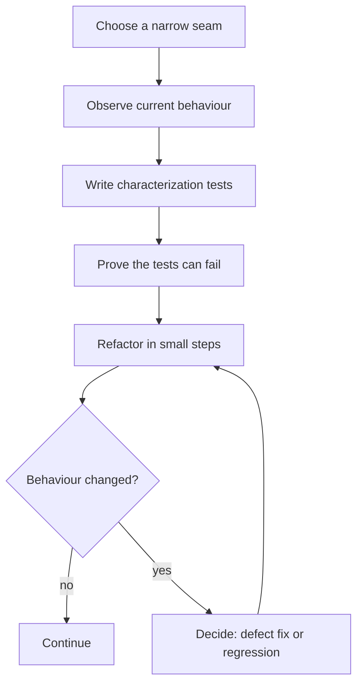

# Pattern: Characterization tests before agent-led refactoring

> **Status:** Publication candidate  
> **Last verified:** 2026-08-31  
> **Use when:** existing behaviour matters, but the code and its contract are not yet understood well enough to refactor safely

## Why this pattern exists

An agent can make untidy code look cleaner very quickly. That is useful only if the behaviour stays correct.

In older or poorly documented code, the intended behaviour may be split across implementation details, production examples, bug history and tests that cover only the happy path. Asking an agent to “clean this up” gives it room to make reasonable-looking changes to behaviour nobody has made explicit.

A characterization test records what the system does **before** the refactor. It creates a tripwire around observed behaviour while you work out which parts are intentional and which are defects.

It is not proof that the old behaviour is right. It is proof that a later change is visible.

## Where it fits



Run this before changing the implementation. If the agent writes the tests after the refactor, the tests characterize the new code and cannot tell you what was lost.

## Start with a seam, not the whole application

Choose one callable boundary: a parser, serializer, pricing rule, state transition, API adapter or report renderer. Feed it representative inputs and record the outputs and side effects that callers can observe.

Avoid starting with a snapshot of an entire page, database or log file. Large snapshots change for unrelated reasons and train people to approve updates without reading them.

A small JSON corpus works well:

```json
[
  {
    "name": "missing optional label",
    "input": {"state": "ready", "label": null},
    "observed": {"summary": "ready", "actionable": true}
  },
  {
    "name": "unknown state is retained",
    "input": {"state": "waiting-on-vendor", "label": "dependency"},
    "observed": {"summary": "waiting-on-vendor: dependency", "actionable": false}
  }
]
```

The test should remain straightforward:

```python
import json
from pathlib import Path

import pytest

from package.legacy_summary import summarize


CASES = json.loads(
    Path("tests/characterization/summary_cases.json").read_text(encoding="utf-8")
)


@pytest.mark.parametrize("case", CASES, ids=lambda case: case["name"])
def test_summary_matches_observed_behaviour(case):
    assert summarize(case["input"]) == case["observed"]
```

The corpus is reviewable, can grow one case at a time and separates observations from the test runner.

## Capture more than happy paths

Use examples from the real boundary, then add cases for:

- missing, empty and null values;
- unknown enum values and extra fields;
- ordering and duplicate inputs;
- exceptions and error messages that callers depend on;
- rounding, time zones and boundary dates;
- retries, idempotency and repeated calls; and
- side effects such as emitted events or files.

Do not guess expected values. Run the existing code, inspect the result and record how the observation was obtained. If an input is sensitive, reduce it to a synthetic example that preserves the behaviour.

## Normalise only genuine noise

Timestamps, generated IDs, temporary paths and unstable ordering can make a useful test flaky. Normalise those fields before comparison, but keep the normaliser narrow and visible:

```python
def stable_result(result: dict) -> dict:
    return {
        "status": result["status"],
        "items": sorted(result["items"], key=lambda item: item["name"]),
        # request_id and generated_at are excluded because they are non-deterministic
    }
```

Every excluded field removes protection. A normaliser that drops most of the
output produces a stable test only because it can no longer notice much change.

## Prove the safety net is connected

A green characterization suite is weak evidence until you have seen it fail for the behaviour it claims to protect.

Make one temporary mutation at the seam, such as changing a comparison, removing a field or reversing an ordering rule. Run the focused test and confirm that the relevant case fails. Revert the mutation before committing.

Record the command in the delivery evidence:

```text
Before refactor: 18 characterization cases passed.
Sensitivity check: changing unknown-state handling made 2 named cases fail.
After refactor: the same 18 cases passed.
```

This is a lightweight mutation check, not a claim of full mutation-test coverage.

## Do not bless defects by accident

Characterization tests preserve observed behaviour, including bugs. When a surprising result appears, classify it before proceeding:

| Observation | Action |
|---|---|
| required compatibility | keep the case and explain the constraint |
| confirmed defect in scope | write the intended acceptance test, then update the characterisation explicitly |
| suspected defect outside scope | keep the observed case and create a follow-up decision or work item |
| output nobody relies on | narrow or remove the case, with review evidence |

Do not update the expected output merely because the refactor made the test fail. That turns the safety net into an approval button for the implementation.

A useful repository rule is:

```text
Changes to tests/characterization/** must name the acceptance requirement,
decision, or defect that authorizes each expected-output change.
```

Enforce that rule in review or with a small path-based gate if the corpus becomes important.

## Give the agent an explicit contract

Put the instruction where planning and implementation workers will both receive it:

```markdown
When changing a characterized seam:

1. Run its characterization tests before editing implementation code.
2. Do not change observed outputs during a behaviour-preserving refactor.
3. If behaviour must change, link the acceptance requirement and add an intentional test.
4. Run a sensitivity check and the focused suite before the full test layers.
5. Report the before, sensitivity and after evidence separately.
```

If your harness uses refactoring or architecture skills, invoke them during planning and implementation, but keep this repository rule alongside them. A general skill will not know which local seams are characterized or who may authorize an output change.

Nested agents need the same instruction. Do not assume a parent agent's loaded skill or context automatically reaches a child reviewer or implementation worker. See [Agent-enforced engineering standards](agent-enforced-engineering-standards.md) for the invocation pattern.

## Wire the focused suite into CI

Characterization tests should run in the normal test command if they are cheap. If they need a separate job, make it an explicit required check rather than an optional script people have to remember:

```yaml
jobs:
  characterization:
    runs-on: ubuntu-latest
    steps:
      - uses: actions/checkout@v4
      - uses: actions/setup-python@v5
        with:
          python-version: "3.12"
      - run: python -m pip install -r requirements-dev.txt
      - run: pytest tests/characterization -q
```

For slow external boundaries, keep a small deterministic corpus in the pull-request path and run the larger replay separately. A missing external system is `could-not-assess`, not a clean characterization result.

## Know when to retire the tests

Characterization tests are scaffolding. Keep them while they protect compatibility that still matters. As the contract becomes understood:

- replace broad output snapshots with focused acceptance and unit tests;
- keep only compatibility examples that callers still rely on;
- delete normalizers that are no longer needed; and
- document intentional changes instead of carrying every historical quirk forever.

The goal is not to freeze the system. The goal is to make behavioural change deliberate.

## What this pattern does not claim

Characterization tests do not prove correctness, discover every hidden dependency or replace acceptance tests. They also do not make a large automated refactor safe by themselves.

They provide one concrete property: when the agent changes behaviour at the chosen seam, the change is more likely to become a visible decision instead of an unnoticed side effect.

## Related patterns

- [Agent-enforced engineering standards](agent-enforced-engineering-standards.md)
- [Fast feedback and merge evidence](test-evidence-layers.md)
- [Complete guardrail contract](complete-guardrail-contract.md)
- [Three-outcome script contract](script-three-outcome-contract.md)
