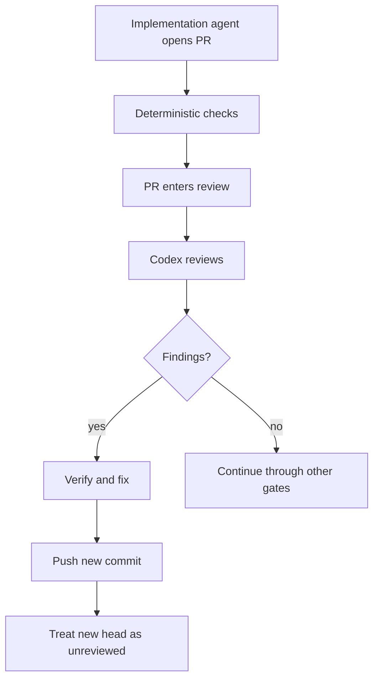

# Pattern: Codex code review as an external review signal

> **Status:** Observed integration pattern  
> **Last verified:** 2026-08-31  
> **Tested route:** Codex code review through the GitHub connector  
> **Enforcement:** quality signal only; not an independent approval or a complete merge gate

## Why this pattern exists

A second model can find defects missed by the implementation agent and green
tests. Another review only helps if you know when it ran, which commit it covered
and what its absence means.

Here, **external** means outside the authoring model's session and credentials. It does not mean an independent audit.

## What we actually used

The implementation agent opened pull requests. For pull requests authored by the connected account, moving the change into review caused the Codex GitHub integration to post a native review with inline findings.

Those reviews found real defects. The implementation loop checked the findings, made changes where needed and continued through the normal merge controls.

## The limitations we observed

Two trigger gaps mattered:

- later pushes did not reliably start a fresh automatic review; and
- automatic review did not start for pull requests authored by the delivery loop's GitHub App.

This means the connector review was useful evidence, but it could not honestly be treated as a required, always-current gate.

OpenAI documents the manual `@codex review` trigger. That can be used to request another pass, but it was not the orchestration mechanism proven in the source system. Test it with the same author identity and pull-request lifecycle you intend to use.

## Bind the review to the commit

A review of commit A does not approve commit B, even when B only fixes a finding. Record or inspect the review's commit and compare it with the current pull-request head.

| State | Meaning |
|---|---|
| current review, no blocking findings | useful review signal; continue to other gates |
| current review, unresolved findings | block until resolved and reviewed as required |
| no review or stale review | no current Codex evidence |

Do not translate “no review” into “clean”.

## A failed gate design

An early merge rule accepted resolved connector findings as sufficient second-party evidence. That was too weak. The same delivery loop could receive the finding, change the code and influence how the thread was resolved, while later commits were not reliably re-reviewed.

That route was retired. A cross-model review can improve quality without becoming independent authority.

## Treat findings as evidence to investigate

A model finding is not automatically correct. Verify it against the code, requirement and tests. Keep the native review thread so the claim and response remain visible.

Record at least:

- pull request and reviewed commit;
- trigger and reviewer identity;
- whether the review completed;
- findings and their resolution; and
- the final commit that passed the actual merge gates.

## Protect repository review guidance

Codex can use repository-specific instructions. Keep those rules short and
testable: name local authorisation boundaries, idempotency requirements,
migration rules or regression-test expectations.

Review changes to those instructions carefully. If the author can weaken the review rules in the same change, the signal becomes less trustworthy.

## What this pattern does not claim

It does not claim that:

- Codex is independent authority;
- no findings means the change is defect-free;
- the connector reliably re-reviews every new commit;
- bot-authored pull requests receive automatic review; or
- CI-managed Codex review was implemented.

A CI-managed review using the Codex SDK or GitHub Action is a possible extension. It could provide a structured, commit-bound status, but it adds credentials, workflow code and failure modes that must be designed and tested. It should be documented as a separate implementation after it exists.

## Further reading

- [OpenAI: Codex code review for GitHub](https://developers.openai.com/codex/third-party/github)
- [Review evidence bound to a commit](review-evidence-commit-binding.md)
- [Reviewer isolation](reviewer-isolation.md)
- [Three-outcome contract](script-three-outcome-contract.md)
