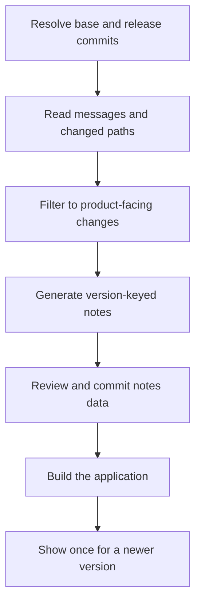

# Pattern: commit-bound release notes and a once-per-version splash

> **Status:** Reference implementation · **Last verified:** 2026-09-04  
> **Tested against:** `scripts/generate_release_notes.py` (`tests/test_generate_release_notes.py`)  
> **Enforcement:** Release workflow, committed notes data and frontend smoke test  
> **Reference implementation:** `scripts/generate_release_notes.py`

## Problem

Release notes are easy to automate badly. Give an agent a pile of commit messages
and ask for a cheerful summary, and it can produce polished claims that are only
loosely connected to what shipped. It may include internal CI work, omit an
important fix, describe an unfinished ticket, or regenerate a released version
from an empty range and quietly erase yesterday's notes.

The splash screen has a different failure mode. Show it on every login and it
becomes furniture. Never show it automatically and most users will not discover
the release notes at all.

The useful pattern is to make release communication part of the release evidence:

- derive candidate notes from one explicit Git range;
- classify audience from changed paths, not optimistic wording;
- retain the source range with the generated entry;
- commit the generated data that the application actually renders; and
- show that version once to an existing browser, then remember the acknowledgement.

The prose can still be edited. The evidence boundary cannot.



## The load-bearing rules

### Start from an immutable range

Pass the generator an exact base and head commit, or tags already resolved to
commits. Do not ask an agent to infer what “the latest release” means while it is
also writing the notes. Record both identities in the output.

This makes a sentence in the release notes traceable to a finite set of commits.
It does not prove the sentence is good, but it stops the source material moving
underneath the review.

### Use commit messages for grouping, changed paths for audience

Conventional Commit types are useful for grouping:

| Commit shape | User-facing section |
|---|---|
| `feat:` | Features |
| `fix:` or `perf:` | Fixes |
| `type!:` or a `BREAKING CHANGE:` footer | Breaking |
| `docs:`, `test:`, `chore:` | omitted |

They are not enough to decide whether a user cares. `fix(ci):` can quite properly
bump a patch version while still being irrelevant to a product splash.

Use a small allowlist of product paths and carve generated notes data out of it.
Otherwise the commit that updates `web/src/generated-release-notes/notes.json`
will classify itself as a product change and appear in the next release. Release
notes about the release-notes generator are a niche interest.

### Keep empty, failed and internal-only distinct

An empty list can be legitimate when a version contains only internal work. A
failed `git log`, malformed record or missing source ref is not the same result.
Let those failures stop the release step instead of publishing “nothing changed.”

The UI should also distinguish:

- notes exist and contain product changes;
- notes exist but the release is internal-only; and
- no notes exist for the running version.

### Never let a rerun erase good notes

Release workflows are retried. A build may also run after a version tag has been
created, when a naïve `latest-tag..HEAD` range is empty. Generation must be
idempotent, and an empty rerun must not replace an existing non-empty entry.

Either reconstruct the original `previous-tag..released-tag` range or refuse the
downgrade. The reference implementation does the latter and records the supplied
range so the caller can diagnose it.

### Commit what the application renders

Treat the JSON as version-controlled source when the frontend imports it at build
time. Generate it in a dedicated release-preparation change, review the diff, and
commit it separately from the product changes it describes.

That separate commit should not be inside its own source range. The sequence is:

1. resolve the release head;
2. generate notes for `previous-release..release-head`;
3. review and commit the notes data; and
4. build from the notes commit while retaining `release-head` as the described
   product identity.

The notes commit changes communication, not the historical set of product changes.

## Reference generator

The full tested example is in
[`scripts/generate_release_notes.py`](../scripts/generate_release_notes.py). Its
core keeps the original implementation's useful mechanics: Conventional Commit
grouping, path-based audience filtering, deterministic JSON and protection against
an empty rerun.

```python
@dataclass(frozen=True)
class Commit:
    message: str
    paths: tuple[str, ...]


def is_product_change(paths, product_prefixes, excluded_prefixes):
    return any(
        path.startswith(product_prefixes)
        and not path.startswith(excluded_prefixes)
        for path in paths
    )


def upsert(path: Path, entry: dict[str, object]) -> None:
    data = json.loads(path.read_text()) if path.exists() else {}
    existing = data.get(entry["version"])
    if existing and existing.get("sections") and not entry.get("sections"):
        raise ValueError(
            "refusing to replace non-empty release notes with an empty entry"
        )
    data[entry["version"]] = entry
    path.write_text(json.dumps(data, indent=2, sort_keys=True) + "\n")
```

Call it with refs resolved by the trusted release workflow:

```bash
python scripts/generate_release_notes.py \
  --repo . \
  --output web/src/generated-release-notes/notes.json \
  --version 1.4.0 \
  --released-at 2026-09-04 \
  --base "$PREVIOUS_RELEASE_SHA" \
  --head "$RELEASE_SHA" \
  --product-prefix service/ \
  --product-prefix web/src/ \
  --exclude-prefix web/src/generated-release-notes/
```

The resulting entry carries its evidence boundary:

```json
{
  "1.4.0": {
    "released_at": "2026-09-04",
    "sections": [
      {
        "heading": "Features",
        "items": ["add saved search filters (#42)"]
      }
    ],
    "source": {
      "base": "abc123...",
      "head": "def456..."
    },
    "version": "1.4.0"
  }
}
```

## Optional agent editing

Raw commit subjects are often accurate but clumsy. An agent can turn them into
clearer user-facing text after deterministic collection and filtering, provided
it works inside a narrow contract:

- it receives only the selected commits, their paths and linked ticket text;
- every output item retains the commit or ticket identifiers that support it;
- it may combine duplicate descriptions but may not introduce a new claim;
- it must not promote tests, refactors or infrastructure work into product
  benefits without evidence of user-visible behaviour; and
- a human reviews the generated diff before it becomes release source.

If an item cannot be supported, drop it or flag it for review. “Sounds plausible”
is not a release-note category.

## Once-per-version splash

Bundle notes for the running application version and keep the splash decision
small. A first-time browser should normally be seeded as caught up so release
notes do not interrupt onboarding. Existing browsers see the dialog only when
the running semantic version is newer than the version they acknowledged.

```typescript
const ACKED_VERSION_KEY = 'releaseNotes.ackedVersion'

export function useReleaseNotesSplash(version: string, enabled: boolean) {
  const [showSplash, setShowSplash] = useState(false)

  useEffect(() => {
    if (!enabled) return
    const acknowledged = localStorage.getItem(ACKED_VERSION_KEY)
    if (acknowledged === null) {
      localStorage.setItem(ACKED_VERSION_KEY, version)
    } else if (compareSemver(version, acknowledged) > 0) {
      setShowSplash(true)
    }
  }, [enabled, version])

  const acknowledge = () => {
    localStorage.setItem(ACKED_VERSION_KEY, version)
    setShowSplash(false)
  }
  return { showSplash, acknowledge }
}
```

Use a numeric semantic-version comparison. Lexical comparison gets `1.10.0` and
`1.9.0` wrong, which is an impressively small bug with a surprisingly long life.

Gate the hook on authentication so the dialog never appears over the login page.
Closing or explicitly dismissing the dialog should acknowledge the running
version. Merely rendering it should not.

## Workflow wiring

```yaml
- name: Resolve release evidence range
  run: |
    echo "PREVIOUS_RELEASE_SHA=$(git rev-list -n 1 "$PREVIOUS_TAG")" >> "$GITHUB_ENV"
    echo "RELEASE_SHA=$(git rev-parse HEAD)" >> "$GITHUB_ENV"

- name: Generate bundled release notes
  run: |
    python scripts/generate_release_notes.py \
      --output web/src/generated-release-notes/notes.json \
      --version "$RELEASE_VERSION" \
      --released-at "$(date -u +%F)" \
      --base "$PREVIOUS_RELEASE_SHA" \
      --head "$RELEASE_SHA" \
      --product-prefix service/ \
      --product-prefix web/src/ \
      --exclude-prefix web/src/generated-release-notes/

- name: Refuse an unreviewed generated diff
  run: git diff --exit-code -- web/src/generated-release-notes/notes.json
```

The last step fits a build that expects release notes to have been prepared and
committed already. If the workflow is responsible for opening a release-notes PR,
replace it with a deliberate branch, commit and pull-request step. Do not let a
release job push an unexplained change directly to the protected branch.

## Tests that earn confidence

The reference tests cover the awkward directions:

- a feature touching product paths is included;
- a correctly scoped CI fix is excluded;
- generated notes data cannot make its own commit product-facing;
- breaking-change syntax wins over ordinary grouping;
- two identical runs produce byte-for-byte identical JSON; and
- an empty rerun cannot erase existing non-empty notes.

For the UI, add a browser-level smoke scenario rather than relying only on hook
tests:

```gherkin
Scenario: A newer release is shown once
  Given I am signed in and previously acknowledged version "1.3.0"
  And the running version is "1.4.0"
  When I open the application
  Then the release notes for "1.4.0" appear
  When I close the release notes and reload
  Then the release notes do not appear again
```

Also test first-time browsers, older deployed versions, malformed version strings,
an internal-only release and a build whose version has no matching notes entry.

## Limits

- Conventional Commits are input discipline, not proof that a description is true.
- A path allowlist can omit a new product directory until someone updates it.
- A commit that mixes product and internal work is included as a whole; splitting
  commits makes the evidence clearer.
- Browser-local acknowledgement is per browser, not per user or account.
- Committed JSON can still be edited dishonestly. Review the generated diff and
  keep the recorded source range.
- This pattern communicates what changed. It does not prove the release was
  tested, approved or successfully deployed.

## Related patterns

- [Mechanical claim-discipline rules](claim-discipline-rules.md)
- [Machine-checked documentation claims](machine-checked-docs.md)
- [Review evidence bound to a commit](review-evidence-commit-binding.md)
- [Release SBOM and built-image scanning](release-sbom-and-image-scanning.md)
