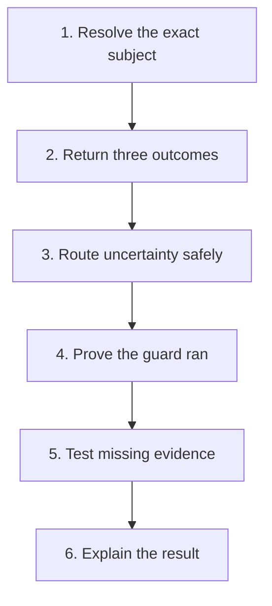

# Pattern: the complete guardrail contract

> **Status:** Observed pattern · **Last verified:** 2026-08-31  
> **Enforcement:** review checklist + tests for clean, verdict and unavailable states  
> **Related pattern:** [Three-outcome contract](script-three-outcome-contract.md)

## Problem

A guardrail can be correct on its happy path and still provide no protection.

Common examples:

- it returns success when an API call fails;
- it checks the wrong pull request;
- it never runs because its workflow trigger is wrong;
- it reports an empty result without saying whether the source was empty or
  unavailable;
- it blocks correctly but gives no information anyone can act on; or
- the script exists but nothing invokes it.

Pass, fail and could-not-assess solve only part of this. A production guardrail
needs a complete contract.

## The six obligations



### 1. Resolve the exact subject

The guard must prove what it is checking before it evaluates anything.

Examples include:

- the current pull request rather than the most recently updated one;
- the current head SHA rather than a branch name that can move;
- the configured board rather than the first board returned by an API; and
- the expected check run from an authorised source rather than any check with a
  similar name.

Failure to resolve the subject is could-not-assess, never clean.

### 2. Return three outcomes

Every guardrail reports:

| Outcome | Meaning |
|---|---|
| clean | the evidence was available and the rule was satisfied |
| verdict | the evidence was available and the rule was broken |
| could-not-assess | the guard could not obtain or interpret enough evidence |

Use distinct process exits or an equivalent typed result. Do not hide the third
state in log text while returning success.

### 3. Route uncertainty safely

Could-not-assess must go to the safer path.

That does not always mean “stop the entire system.” It means the result cannot
be used as evidence that the guarded condition passed. The caller may retry,
escalate, defer an expensive action or block a merge, depending on the risk.

Define that routing at the caller. A script returning exit 2 is not fail-closed
if the workflow ignores it.

### 4. Prove that the guard ran

A missing guard and a clean guard must be visibly different.

Useful evidence includes:

- a required status tied to the current commit;
- a run receipt written by an external supervisor;
- a stable check name with a scope verdict;
- a timestamped result artifact; or
- a controller checkpoint showing the transition completed.

A guard cannot be its own only liveness witness. If the process never starts, it
cannot write “I did not start.”

Also verify registration. A hook file that is not listed in the active hook
configuration is documentation, not enforcement.

### 5. Test missing and broken evidence

The test suite must include more than a clean example and a detected violation.

Test at least:

- missing configuration;
- empty but valid source;
- unavailable API or file;
- ambiguous subject;
- malformed response;
- permission failure;
- stale evidence;
- guard not invoked; and
- failure in the reporting path itself.

These tests often find more serious defects than the rule's main comparison.

### 6. Explain the result

A correct but vague failure wastes another investigation.

A useful message names:

- what was checked;
- the exact subject;
- what was expected;
- what was observed;
- whether the result is a verdict or could-not-assess; and
- the next action a person or controller can take.

“Lookup failed” is not enough. Include the endpoint, path, status, exception or
missing field that made the assessment impossible, while keeping secrets
redacted.

## Reviewer questions

When a change adds or edits a guardrail, ask:

1. Can it prove it selected the right subject?
2. Can it distinguish empty, absent and unavailable?
3. Where is uncertainty routed?
4. What proves the guard executed?
5. Is the registration or workflow trigger tested?
6. Can someone act on every failure message?
7. Can the author bypass or weaken the result?
8. Is the evidence bound to the current artifact or commit?

## Relationship to other patterns

- [Three-outcome contract](script-three-outcome-contract.md) defines the result
  vocabulary.
- [Review evidence bound to a commit](review-evidence-commit-binding.md) handles
  stale approvals.
- [Machine-checked documentation](machine-checked-docs.md) can prove that
  registration and stated configuration still match.
- [Reviewer isolation](reviewer-isolation.md) controls who can publish an
  approval result.

## Limits to understand before using this

- A checklist can confirm that a control has the right shape without proving its
  rule is correct.
- Liveness evidence needs its own trust boundary. A receipt written by the same
  process adds little.
- Fail-closed routing can create availability problems. Make the trade-off
  explicit rather than silently failing open.
- Actionable diagnostics must still redact credentials and sensitive content.

## Minimal reference implementation

The contract is easier to understand as a small executable guard. This example checks that a pull-request description contains a required evidence section.

```python
# scripts/check_evidence.py
from __future__ import annotations

import argparse
import json
from dataclasses import asdict, dataclass
from pathlib import Path


@dataclass(frozen=True)
class Result:
    outcome: str
    subject: str
    reason: str


def assess(body_path: Path, head_sha: str) -> Result:
    subject = f"pull-request-head:{head_sha}"

    try:
        body = body_path.read_text(encoding="utf-8")
    except OSError as exc:
        return Result("could-not-assess", subject, f"cannot read body: {exc}")

    if not head_sha or len(head_sha) < 7:
        return Result("could-not-assess", subject, "head SHA is missing or invalid")

    marker = "## Verification evidence"
    if marker not in body:
        return Result("findings", subject, f"missing section: {marker}")

    return Result("clean", subject, "required section is present")


def main() -> int:
    parser = argparse.ArgumentParser()
    parser.add_argument("--body", type=Path, required=True)
    parser.add_argument("--head-sha", required=True)
    parser.add_argument("--json-output", type=Path, required=True)
    args = parser.parse_args()

    result = assess(args.body, args.head_sha)
    args.json_output.write_text(json.dumps(asdict(result), indent=2) + "\n")

    print(f"{result.outcome}: {result.subject}: {result.reason}")
    return {"clean": 0, "findings": 1, "could-not-assess": 2}[result.outcome]


if __name__ == "__main__":
    raise SystemExit(main())
```

The subject is part of the result. Without it, a clean verdict can be reused against the wrong change.

## Tests

```python
# tests/test_check_evidence.py
from pathlib import Path

from scripts.check_evidence import assess


def test_clean_result_is_bound_to_head(tmp_path: Path) -> None:
    body = tmp_path / "body.md"
    body.write_text("## Verification evidence\n- tests passed\n")

    result = assess(body, "abc1234567")

    assert result.outcome == "clean"
    assert result.subject == "pull-request-head:abc1234567"


def test_missing_section_is_a_finding(tmp_path: Path) -> None:
    body = tmp_path / "body.md"
    body.write_text("No evidence here")

    assert assess(body, "abc1234567").outcome == "findings"


def test_missing_file_is_not_clean(tmp_path: Path) -> None:
    result = assess(tmp_path / "missing.md", "abc1234567")

    assert result.outcome == "could-not-assess"


def test_invalid_subject_is_not_clean(tmp_path: Path) -> None:
    body = tmp_path / "body.md"
    body.write_text("## Verification evidence")

    assert assess(body, "").outcome == "could-not-assess"
```

## CI registration

```yaml
name: Evidence guard

on:
  pull_request:
    types: [opened, synchronize, reopened, ready_for_review]

jobs:
  evidence-guard:
    runs-on: ubuntu-latest
    permissions:
      contents: read
      pull-requests: read
    steps:
      - uses: actions/checkout@v4
      - name: Save pull-request body
        env:
          PR_BODY: ${{ github.event.pull_request.body }}
        run: printf '%s\n' "$PR_BODY" > "$RUNNER_TEMP/pr-body.md"
      - name: Run guard
        run: |
          python scripts/check_evidence.py \
            --body "$RUNNER_TEMP/pr-body.md" \
            --head-sha "${{ github.event.pull_request.head.sha }}" \
            --json-output "$RUNNER_TEMP/evidence-result.json"
      - name: Upload result
        if: always()
        uses: actions/upload-artifact@v4
        with:
          name: evidence-guard-result
          path: ${{ runner.temp }}/evidence-result.json
```

## Test the registration, not just the function

A repository-level test can parse the workflow and prove the script is still called.

```python
from pathlib import Path

import yaml


def test_evidence_guard_is_registered() -> None:
    workflow = yaml.safe_load(
        Path(".github/workflows/evidence-guard.yml").read_text()
    )
    steps = workflow["jobs"]["evidence-guard"]["steps"]
    commands = "\n".join(step.get("run", "") for step in steps)

    assert "scripts/check_evidence.py" in commands
    assert "pull_request.head.sha" in commands
```

## Failure-path checklist

Before making a guard required, prove:

- its subject is missing;
- its input file is absent;
- its input is malformed;
- the workflow trigger is removed;
- the script exists but is no longer called;
- the verdict is for an older commit; and
- the result artifact cannot be written.

Every infrastructure or evidence failure must remain distinguishable from a policy finding.
