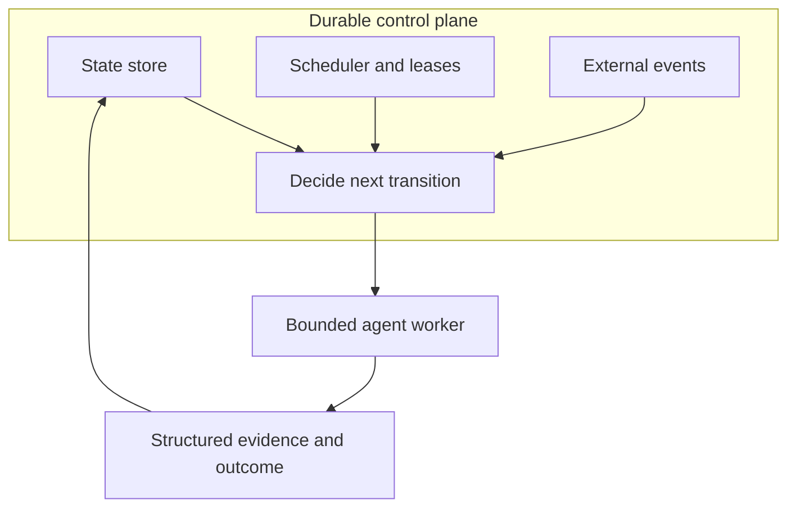
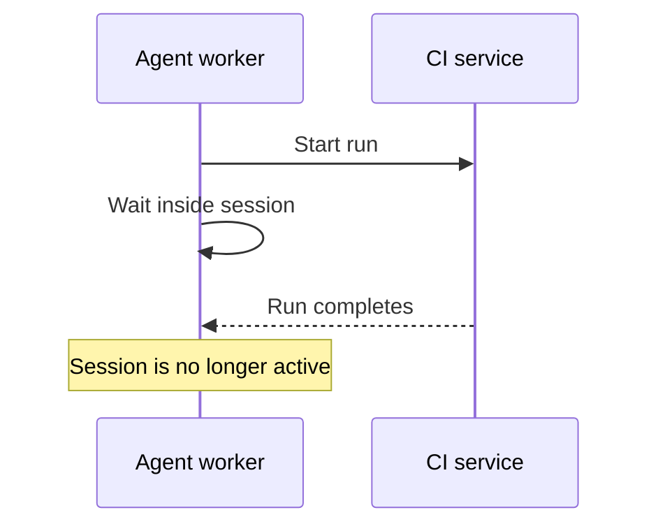
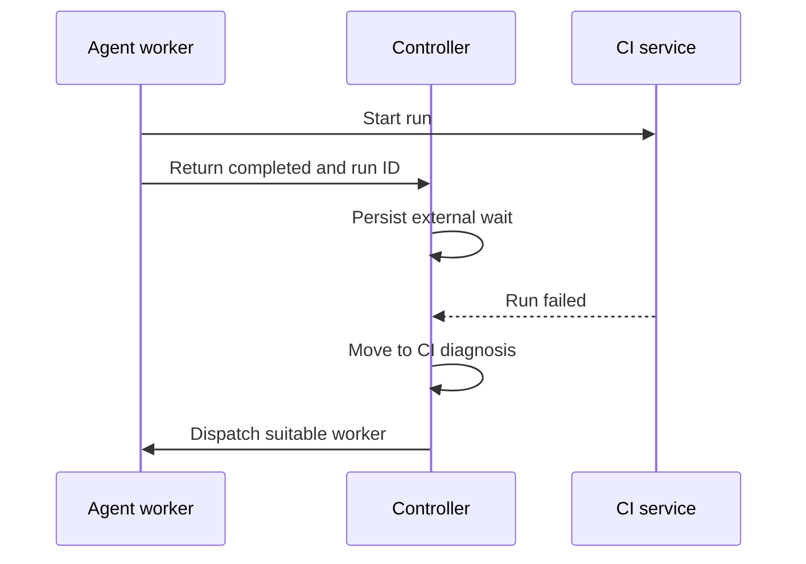
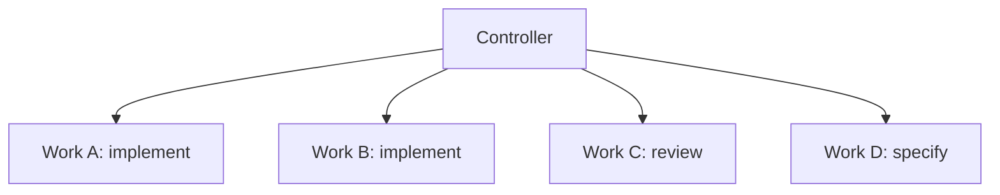
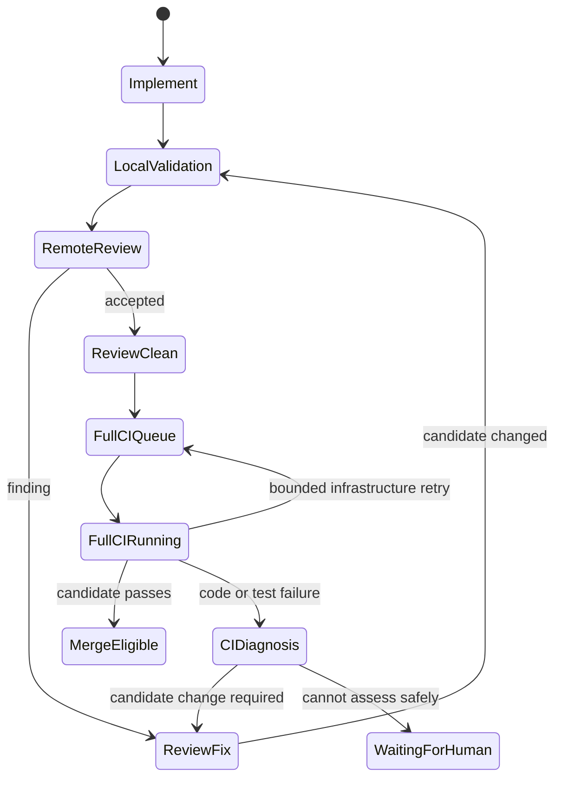

# Pattern: durable controller, disposable agent workers

> **Status:** Work in progress · **Last verified:** 2026-08-31  
> **Tested against:** extracted from a live autonomous delivery loop after repeated session-liveness and CI-wait stalls  
> **Enforcement:** deterministic controller owns state transitions; agents own bounded work  
> **Reference implementation:** pattern only; adapt the state store and scheduler to your platform
>
> **Work in progress:** the controller described here is still being implemented and
> tuned. The responsibility boundary is stable, but state names, configuration and
> operational details may change. This page will gain validated implementation
> examples once the controller has completed its rollout and observation period.
> Treat it as design guidance for now, not as a drop-in implementation.

## Problem

A long-lived conversational agent is an attractive first orchestrator: give it a board, teach it the workflow, let it spawn subagents and ask it to keep going.

That design works until the conversation itself becomes part of correctness.

Typical symptoms:

- the orchestrator must remember to schedule its own next wake-up;
- a subagent waits on CI and never gets re-entered after the wait completes;
- a crash loses the scheduler and the in-session watchdog at the same time;
- the supervisor tries to infer whether an arbitrary chat session is "alive";
- several agents independently decide when to consume shared CI capacity;
- the model encounters an ambiguous workflow condition and treats it as a reason to stop;
- recovery requires reconstructing state from conversation history.

The underlying mistake is architectural:

> **The LLM is being used as both the worker and the workflow engine.**

Those are different responsibilities.

## Principle

> **Agents decide how to perform a bounded transition. Deterministic software decides which transition runs next.**

The durable controller owns:

- workflow state;
- scheduling;
- retries;
- leases / work ownership;
- timeouts;
- external-event reconciliation;
- concurrency and admission control;
- merge/deployment policy;
- the mapping from evidence to the next state.

Agent workers own bounded cognition-heavy tasks such as:

- write a design;
- implement a ticket;
- review a diff;
- diagnose a failing CI job;
- propose a remediation;
- classify an ambiguous requirement for escalation.

A worker returns an outcome and can then disappear.

## Target shape



The test of the architecture is simple:

> If the current agent session is killed, can another worker determine what to do next from durable state and external facts alone?

If not, the conversation still owns part of the workflow.

## Minimal state model

You do not need Temporal on day one. A small database or even a carefully designed durable store is enough to establish the boundary.

Example:

```text
workflow_id: work-042
work_item: 42
state: IMPLEMENTING
attempt: 2
worker_id: worker-abc123
lease_expires_at: 2026-08-28T21:42:00Z
head_sha: abcdef1234
external_run_id: null
last_outcome: null
```

Possible states:

```text
READY
IMPLEMENTING
LOCAL_VALIDATION
REMOTE_REVIEW
REVIEW_FIX
REVIEW_CLEAN
FULL_CI_QUEUE
FULL_CI_RUNNING
CI_DIAGNOSIS
MERGE_ELIGIBLE
WAITING_FOR_HUMAN
MERGED
FAILED
```

The exact graph is less important than one rule: **state exists outside the agent session.**

## Controller tick

A straightforward controller is a good first implementation.

```python
def tick():
    reconcile_external_state()
    recover_expired_leases()
    for workflow in runnable_workflows():
        transition = decide_next_transition(workflow)
        if capacity_available(transition):
            dispatch(workflow, transition)
```

Run it under a normal scheduler or service manager. A one-minute tick is often better than a fragile conversational wake-up because reliability matters more than elegance at this layer.

Webhooks can reduce latency later. They should wake or inform the same durable controller, not create a second execution model.

## Bounded worker contract

Do not dispatch an agent with:

> Own this ticket end-to-end and keep monitoring it until it is merged.

Dispatch it with something like:

> Perform transition `IMPLEMENT` for workflow `work-042`. Use the supplied worktree and acceptance criteria. Return one structured outcome.

Useful outcomes:

```text
COMPLETED
FAILED_RETRYABLE
FAILED_PERMANENT
NEEDS_HUMAN
```

`NEEDS_HUMAN` should require structured evidence:

```json
{
  "outcome": "NEEDS_HUMAN",
  "reason": "missing_external_authority",
  "evidence": "...",
  "requested_action": "approve security-boundary change",
  "why_worker_cannot_complete": "worker lacks approval authority"
}
```

These should normally **not** be human blockers:

- CI is running;
- review is running;
- another worker is active;
- a queue slot is unavailable;
- a retryable API call failed;
- the workflow needs its next state transition.

The worker returns control. The controller waits, retries or schedules.

## Leases: own work, not conversations

When a worker starts a transition, give it a lease:

```text
workflow: work-042
transition: IMPLEMENT
worker: worker-abc123
lease_expires_at: 21:42
```

A heartbeat may renew this lease while the worker is actively performing the bounded transition.

If the lease expires:

```text
mark attempt lost or suspect
inspect/reconcile external side effects
increment attempt if safe
redispatch
```

Do not ask "is the Claude session alive?" as the primary recovery question. Ask "does any worker still have a valid claim on this transition?"

See [Deadline-based heartbeat protocol](agent-beats-heartbeat.md).

## External waits belong to the controller

This is the most important practical consequence.

Bad:



Good:



The worker that started the external operation does not have to survive the wait.

## Parallelism

This pattern does **not** serialize agentic development. It makes concurrency explicit.

Example:



Each owns a separate workflow transition and, ideally, an isolated worktree/test environment.

The controller can also impose capacity limits by transition class:

```text
implementation slots: 4
review slots:         4
full-CI slots:        2
merge slots:          1
```

That lets cheap cognition-heavy work proceed in parallel without allowing a fleet of agents to stampede a scarce runner pool.

## Separate review convergence from expensive CI

A durable controller makes it easy to model review and verification as distinct phases.

Recommended flow:



This avoids repeatedly running the expensive suite between review findings. A
candidate changed after either review or CI must return through local validation
and review; it cannot inherit the earlier review-clean result.

The first remote phases should be cheap enough to iterate. Admit only a review-clean candidate to the expensive suite.

## One policy oracle

Do not let every workflow surface independently decide whether work is complete.

Collect raw facts:

- current SHA;
- CI results;
- review evidence;
- unresolved findings;
- approvals;
- change/risk class;
- branch state;
- deployment state.

Then evaluate one deterministic policy:

```python
decision = evaluate_policy(snapshot)
```

Return a small result vocabulary such as:

```text
ALLOW
WAIT
BLOCK
UNKNOWN
```

The board, status check and CLI can all project that result, but they should not each reimplement the rules.

## Capability/provenance, not display identity

A durable controller often needs to trust evidence produced by different actors. Do not make a display login string the security invariant.

Prefer evidence that identifies:

- producer capability/authority;
- stable platform identity such as an App installation where available;
- subject/workflow;
- exact commit SHA;
- timestamp/freshness;
- verdict/result.

A login is useful diagnostic metadata. It is a poor substitute for the authority that produced the evidence.

See [Capability-isolated reviewer](reviewer-isolation.md) and [Review evidence bound to a commit](review-evidence-commit-binding.md).

## Protect changes to the controller itself

An autonomous system that modifies its own rules needs a stronger path for control-plane changes.

Classify files such as:

```text
controller / scheduler
merge-policy code
review policy
identity/capability configuration
CI policy
deployment policy
workflow definitions
```

as control-plane changes.

Recommended properties:

1. evaluate the PR using the **base branch's policy version**;
2. require stronger review/approval than ordinary product changes;
3. do not let the same PR relax the rule judging itself;
4. record the process/model change in the eval history.

This is the workflow equivalent of preventing a process from rewriting its own
authorisation policy and immediately benefiting from the new rule.

## Board/project state is a projection, not the scheduler

A project board is useful for humans. It is usually too lossy to be the only workflow database.

Keep durable execution state in the controller and synchronize the board from it.

External systems remain authoritative for facts they own — for example GitHub owns the PR SHA and Actions result — but the board should not be the only place that records whether a workflow is waiting, leased, retryable or queued.

## When to adopt Temporal or another workflow engine

Do not introduce a large workflow engine merely because "agent orchestration" sounds like it should have one.

A sensible progression is:

1. explicit durable state;
2. deterministic transition function;
3. leases/retries/timeouts;
4. external event reconciliation;
5. bounded worker invocation;
6. concurrency/admission control;
7. only then ask whether maintaining those semantics yourself has become expensive.

At that point Temporal, Step Functions or another durable workflow engine can replace infrastructure you already understand rather than becoming architecture by aspiration.

## Failure modes this pattern removes

It directly targets:

- forgotten conversational wake-ups;
- subagents that cannot re-enter after external waits;
- crash recovery tied to chat-session existence;
- duplicate in-session watchdogs;
- global workflow state hidden in conversation context;
- autonomous workers competing uncontrolled for expensive resources;
- models treating scheduler conditions as reasons to ask a human what to do next.

It does **not** solve:

- bad requirements;
- bad code;
- correlated reviewer blind spots;
- unsafe merge policy;
- poor tests;
- a controller with incorrect deterministic logic.

Those still need the other harness patterns.

## Prior art

This is standard durable-workflow and distributed-systems separation applied to LLM workers: workflow engines separate durable orchestration from activities; queue systems separate job ownership from workers; cluster schedulers use leases and reconciliation rather than relying on one long-lived client process.

The agent-specific lesson is that a conversational model is particularly tempting to use as the scheduler because it can describe the whole workflow fluently. Fluency is not durability.

## Known limitations, read before implementing

**The controller becomes critical infrastructure.** Move state out of the model and you gain determinism, but you also create a component whose bugs can halt or misroute many workflows. Keep the transition logic small, tested and observable.

**At-least-once execution needs idempotency.** A lease may expire after a worker performed an external side effect but before the controller recorded completion. Reconcile before retrying and make transitions idempotent where possible.

**Do not duplicate truth.** If GitHub owns the current PR SHA or CI result, reconcile it rather than maintaining an independent pretend copy that can drift.

**Durability does not mean autonomy at every risk level.** High-risk control-plane,
security or deployment changes may still require human authority. Make that an
explicit policy state rather than an accidental stall.

**A controller does not make LLM review independent.** It can enforce who may produce an attestation and bind it to a commit, but reasoning diversity is a separate property.

## The reusable test

When designing any new agent workflow transition, ask two questions:

1. **What durable fact says this transition is complete?**
2. **Could a different worker safely perform the next transition without this worker's conversation history?**

If the second answer is no, the workflow still depends on conversational continuity.
