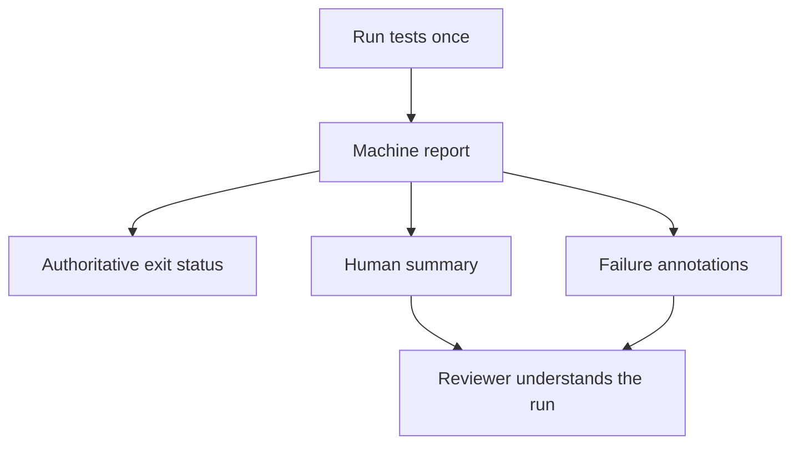

# Pattern: human-readable test and coverage evidence

> **Status:** Observed pattern · **Last verified:** 2026-08-31  
> **Enforcement:** test commands remain authoritative; summaries explain their evidence  
> **Reference implementation:** JUnit XML, Vitest JSON and GitHub Actions job summaries

## Problem

A green or red job tells you whether a command succeeded. It often does not tell
you which tests failed, what was skipped, whether a report was produced, or how
measured coverage compares with the enforced gate.

Raw logs contain the detail, but they are a poor review interface. Generate
machine-readable reports during the test run, then render a short human summary
and inline annotations even when the tests fail.



The renderer explains evidence. It must not become a second implementation of
the test or coverage gate.

## Generate reports at the source

For a Python suite, emit JUnit XML and coverage JSON from the same command that
enforces the coverage threshold:

```bash
pytest tests/ \
  --junitxml=junit-tests.xml \
  --cov=src \
  --cov-report=json:coverage.json \
  --cov-fail-under="$(python scripts/read_coverage_gate.py backend)"
```

For Vitest, keep the normal console reporter and add JSON plus coverage summary
reporters:

```typescript
// vite.config.ts
export default defineConfig({
  test: {
    reporters: ['default', 'json'],
    outputFile: { json: 'vitest-report.json' },
    coverage: {
      reporter: ['text', 'json-summary'],
      thresholds: {
        lines: 90,
        statements: 90,
        branches: 85,
        functions: 88,
      },
    },
  },
})
```

Do not run the suite a second time merely to create the summary. The report
should describe the authoritative execution, not a later attempt that may have a
different result.

## Render test results without hiding the original failure

Install `defusedxml` for the renderer. CI reports are generated by test tools,
but treating XML as hostile by default costs little and avoids unsafe parser
features if an artifact crosses a trust boundary.

```python
# scripts/junit_summary.py
from __future__ import annotations

import html
import os
import sys
from dataclasses import dataclass
from pathlib import Path

from defusedxml import ElementTree as ET


@dataclass(frozen=True)
class Case:
    name: str
    classname: str
    status: str
    message: str = ""


class CouldNotAssess(RuntimeError):
    pass


def read_cases(path: Path) -> list[Case]:
    root = ET.parse(path).getroot()
    cases: list[Case] = []
    for item in root.iter("testcase"):
        failure = item.find("failure")
        error = item.find("error")
        skipped = item.find("skipped")
        if failure is not None or error is not None:
            node = failure if failure is not None else error
            status = "failed"
            message = (node.get("message") or node.text or "").strip()
        elif skipped is not None:
            status = "skipped"
            message = (skipped.get("message") or skipped.text or "").strip()
        else:
            status = "passed"
            message = ""
        cases.append(
            Case(
                name=item.get("name", "unnamed"),
                classname=item.get("classname", "ungrouped"),
                status=status,
                message=message,
            )
        )
    return cases


def render(title: str, paths: list[Path]) -> str:
    existing = [path for path in paths if path.exists()]
    if not existing:
        raise CouldNotAssess("no test report was generated")

    cases = [case for path in existing for case in read_cases(path)]
    passed = sum(case.status == "passed" for case in cases)
    failed = sum(case.status == "failed" for case in cases)
    skipped = sum(case.status == "skipped" for case in cases)
    lines = [
        f"## {title}",
        "",
        f"Passed: **{passed}** · Failed: **{failed}** · Skipped: **{skipped}**",
    ]
    for case in cases:
        if case.status == "failed":
            lines.extend(
                [
                    "",
                    "<details open><summary>"
                    f"{html.escape(case.classname)}::{html.escape(case.name)}"
                    "</summary>",
                    "",
                    f"<pre>{html.escape(case.message[:4000])}</pre>",
                    "</details>",
                ]
            )
    return "\n".join(lines) + "\n"


def main(argv: list[str]) -> int:
    if len(argv) < 3:
        print("usage: junit_summary.py TITLE REPORT...", file=sys.stderr)
        return 2
    try:
        summary = render(argv[1], [Path(item) for item in argv[2:]])
    except (CouldNotAssess, OSError, ET.ParseError) as exc:
        summary = f"## {argv[1]}\n\n⚠️ Report could not be parsed: {exc}\n"
        status = 2
    else:
        status = 0

    target = os.environ.get("GITHUB_STEP_SUMMARY")
    if not target:
        print(summary)
        return status
    with Path(target).open("a", encoding="utf-8") as handle:
        handle.write(summary)
    return status


if __name__ == "__main__":
    raise SystemExit(main(sys.argv))
```

Bound both the number and size of rendered failures. A summary should stay a
summary; retain the full machine report as an artifact when deeper diagnosis is
needed.

## Add annotations where reviewers look

GitHub workflow commands can place a failure on the run's annotation list:

```python
def annotation(case: Case) -> str:
    title = f"{case.classname}::{case.name}".replace("%", "%25")
    message = case.message.replace("%", "%25").replace("\r", "%0D").replace("\n", "%0A")
    return f"::error title={title}::{message}"
```

Annotations are navigation aids, not the gate. The original test command still
owns the job result.

## Single-source the coverage threshold

The displayed gate must come from the same source as the enforced gate. This is
not cosmetic. A stale summary can tell a reviewer that 92% passes an 82% floor
while the test command is actually enforcing 95%.

A small configuration file is enough:

```json
{
  "backend": {"lines": 95},
  "frontend": {
    "lines": 90,
    "statements": 90,
    "branches": 85,
    "functions": 88
  }
}
```

```python
# scripts/read_coverage_gate.py
import json
import sys
from pathlib import Path

document = json.loads(Path("ci/coverage-gates.json").read_text())
print(document[sys.argv[1]][sys.argv[2] if len(sys.argv) > 2 else "lines"])
```

The test command reads it. The summary renderer reads it. No numeric threshold
is repeated in workflow prose.

## Coverage summary example

```python
# scripts/coverage_summary.py
from __future__ import annotations

import json
import os
from pathlib import Path


def summary(report: Path, gates: Path) -> tuple[str, int]:
    if not report.exists():
        return "## Backend coverage\n\n⚠️ Not generated; coverage is unknown.\n", 2
    try:
        measured = json.loads(report.read_text())["totals"]["percent_covered"]
        gate = json.loads(gates.read_text())["backend"]["lines"]
    except (OSError, json.JSONDecodeError, KeyError, TypeError) as exc:
        return f"## Backend coverage\n\n⚠️ Could not read coverage evidence: {exc}\n", 2
    verdict = "meets" if measured >= gate else "is below"
    return (
        "## Backend coverage\n\n"
        f"Measured **{measured:.2f}%**; {verdict} the **{gate}%** gate.\n"
    ), 0


text, status = summary(Path("coverage.json"), Path("ci/coverage-gates.json"))
with Path(os.environ["GITHUB_STEP_SUMMARY"]).open("a", encoding="utf-8") as handle:
    handle.write(text)
raise SystemExit(status)
```

If the report is missing because the test process failed before coverage was
written, say that coverage is unknown. Do not print `0%`: zero is a measurement,
whereas absence means nothing was measured.

## GitHub Actions wiring

```yaml
- name: Run backend tests
  id: backend-tests
  run: |
    gate="$(python scripts/read_coverage_gate.py backend)"
    pytest tests/ --junitxml=junit-tests.xml \
      --cov=src --cov-report=json:coverage.json \
      --cov-fail-under="$gate"

- name: Backend test report
  if: always()
  run: python scripts/junit_summary.py "Backend tests" junit-tests.xml

- name: Backend coverage summary
  if: always()
  run: python scripts/coverage_summary.py
```

`if: always()` keeps the explanation visible on a failing run. It must not turn
the job green: the failing test step remains in the same job and retains its
failure conclusion.

When a scoped CI job legitimately performs no test work, render an explicit
`not applicable` decision from the scope classifier. Do not reuse the normal
test summary heading for a no-op.

## Test the reporting path

At minimum, cover:

- all tests pass;
- one failure and one error;
- skipped tests;
- multiple report files;
- optional integration report absent after an earlier failure;
- every report absent;
- malformed XML or JSON;
- partial nested data;
- output truncation and escaping;
- measured coverage below, equal to and above the gate; and
- a deliberate threshold change updating enforcement and display together.

A useful structural test parses the workflow and refuses any literal coverage
gate outside the chosen source-of-truth file.

## What this does not prove

- A readable report does not prove the right tests were collected. Use explicit
  collection floors or manifests for that separate claim.
- Coverage measures execution, not assertion quality.
- A summary can be correct while bound to the wrong commit. Keep normal CI
  commit binding and branch protection.
- Artifacts can expire. Retain only what the audit or debugging need justifies.

## Related patterns

- [Fast feedback and merge evidence](test-evidence-layers.md)
- [Required checks should always report](required-checks-always-report.md)
- [Three-outcome script contract](script-three-outcome-contract.md)
- [Machine-checked documentation](machine-checked-docs.md)
