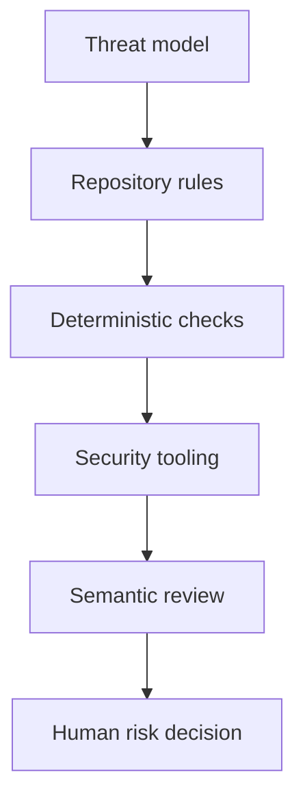

# Pattern: layered security guidance

> **Status:** Implementation pattern · **Last verified:** 2026-08-31  
> **Use when:** coding agents can change security-sensitive code  
> **Goal:** give each security control one clear job

## The problem

A security plugin, a static scanner, and a model review do not provide the same kind of evidence. Treating them as interchangeable leaves gaps and creates noisy duplicate findings.

Use layers. Put cheap, exact rules near the code. Keep judgement-heavy review for risks that cannot be reduced to a simple check.



## Give every layer a job

| Layer | Best at | Do not rely on it for |
|---|---|---|
| Threat model | assets, trust boundaries and plausible abuse | checking every change |
| External guidance or skill | broad prompts and known practices | repository-specific truth |
| Local engineering rules | invariants an agent must follow | discovering unknown risks |
| Deterministic checks | exact banned patterns and required structure | intent or business context |
| Security tooling | known weakness classes and dependency risk | complete coverage |
| Semantic review | misuse cases and interactions across files | repeatable proof on its own |
| Human decision | exceptions and risk acceptance | routine mechanical checking |

## Start from threats, not tools

Name the asset, attacker, entry point and consequence. Then decide which control
can produce useful evidence. Do not include a tool solely because it carries a
security label.

Keep a short list of active threats close to the architecture documentation. Update it when a change introduces a new trust boundary, credential, data class or external integration.

## Turn repeated advice into local rules

External guidance is useful for discovery. Once a lesson becomes important to the repository, rewrite it as a short local rule with:

- the scope it applies to;
- the unsafe behaviour;
- the required alternative;
- how the rule is checked; and
- where an exception is recorded.

This keeps the working instructions specific and avoids loading a large generic security guide on every task.

## Prefer quiet deterministic checks

A useful security check has a narrow subject and an actionable failure. Examples include:

- secrets must not be read in jobs that execute pull-request code;
- authorisation must happen before loading a protected object;
- sensitive values must use the approved redaction helper;
- shell construction must use an argument list rather than string interpolation.

If a rule cannot distinguish a real violation from harmless code, keep it as review guidance until it can.

## Keep uncertainty visible

Security assessment needs the same three outcomes as other guards:

| Outcome | Meaning |
|---|---|
| pass | the control ran and found no blocking issue in its scope |
| fail | it found a blocking issue |
| could not assess | it did not run or its evidence is incomplete |

Do not turn a scanner outage or an unparseable report into a pass.

## Protect the control plane

Rules, scanner configuration and review prompts affect the verdict. Changes to them need review at least as strict as the product change they judge. The author should not be able to weaken a required control and approve that weakening in the same trust boundary.

## Skills are a separate deliverable

Reusable skills can package the discovery prompts and review checklists. Publish them only after checking their provenance, licence and embedded project details. The cookbook should explain the pattern without requiring a particular skill package.

## Further reading

- [OWASP threat modelling](https://owasp.org/www-community/Threat_Modeling)
- [The complete guardrail contract](complete-guardrail-contract.md)
- [Reviewer isolation](reviewer-isolation.md)

## Worked implementation

This example keeps the threat model, deterministic patterns and CI wiring separate. The names are generic so the structure can be reused without copying private project details.

### 1. Record the active threats

```yaml
# security/threats.yaml
threats:
  - id: untrusted-pr-secret-read
    asset: reviewer credential
    entry_point: pull-request workflow
    abuse: pull-request code reads a trusted publishing key
    required_controls:
      - no_secrets_in_untrusted_jobs
      - trusted_verdict_publisher

  - id: authorization-after-load
    asset: tenant-scoped record
    entry_point: API object lookup
    abuse: caller learns or changes another tenant's record
    required_controls:
      - authorize_before_use
```

A threat identifier gives rules, tests and review findings a shared name. Avoid turning the file into a generic catalogue; keep only threats that apply.

### 2. Define narrow deterministic rules

```yaml
# security/patterns.yaml
rules:
  - id: no-secrets-in-pr-execution
    paths:
      - ".github/workflows/*.yml"
    reject_regex: '(pull_request_target|secrets\.)'
    message: "Do not expose secrets to a job that can execute pull-request code."

  - id: no-shell-string-interpolation
    paths:
      - "src/**/*.py"
    reject_regex: 'shell\s*=\s*True'
    message: "Pass an argument list; do not execute an interpolated shell string."
```

Regex is suitable only for patterns with a low false-positive rate. Use a syntax-aware tool when language structure matters.

### 3. Implement the small checker

```python
# scripts/check_security_patterns.py
from __future__ import annotations

import fnmatch
import re
import sys
from pathlib import Path

import yaml


def findings(root: Path, config: Path) -> list[str]:
    document = yaml.safe_load(config.read_text(encoding="utf-8"))
    result: list[str] = []

    for rule in document["rules"]:
        pattern = re.compile(rule["reject_regex"])
        for path in root.rglob("*"):
            relative = path.relative_to(root).as_posix()
            if not path.is_file():
                continue
            if not any(fnmatch.fnmatch(relative, item) for item in rule["paths"]):
                continue
            for number, line in enumerate(
                path.read_text(encoding="utf-8", errors="replace").splitlines(), 1
            ):
                if pattern.search(line):
                    result.append(
                        f"{relative}:{number}: {rule['id']}: {rule['message']}"
                    )
    return result


def main() -> int:
    try:
        result = findings(Path("."), Path("security/patterns.yaml"))
    except (OSError, KeyError, TypeError, yaml.YAMLError) as exc:
        print(f"could-not-assess: {exc}", file=sys.stderr)
        return 2

    if result:
        print("\n".join(result))
        return 1

    print("clean: deterministic security patterns")
    return 0


if __name__ == "__main__":
    raise SystemExit(main())
```

### 4. Prove positive, negative and broken-config cases

```python
# tests/test_security_patterns.py
from pathlib import Path

import pytest
import yaml

from scripts.check_security_patterns import findings


def write_rules(path: Path) -> None:
    path.write_text(
        yaml.safe_dump(
            {
                "rules": [
                    {
                        "id": "no-shell",
                        "paths": ["src/**/*.py"],
                        "reject_regex": r"shell\s*=\s*True",
                        "message": "use an argument list",
                    }
                ]
            }
        )
    )


def test_reports_matching_file_and_line(tmp_path: Path) -> None:
    (tmp_path / "src/jobs").mkdir(parents=True)
    (tmp_path / "src/jobs/run.py").write_text(
        "subprocess.run(command, shell=True)\n"
    )
    config = tmp_path / "patterns.yaml"
    write_rules(config)

    result = findings(tmp_path, config)

    assert result == [
        "src/jobs/run.py:1: no-shell: use an argument list"
    ]


def test_clean_code_has_no_finding(tmp_path: Path) -> None:
    (tmp_path / "src/jobs").mkdir(parents=True)
    (tmp_path / "src/jobs/run.py").write_text(
        "subprocess.run(['tool', value], check=True)\n"
    )
    config = tmp_path / "patterns.yaml"
    write_rules(config)

    assert findings(tmp_path, config) == []


def test_invalid_configuration_cannot_be_clean(tmp_path: Path) -> None:
    config = tmp_path / "patterns.yaml"
    config.write_text("rules: [")
    with pytest.raises(yaml.YAMLError):
        findings(tmp_path, config)
```

### 5. Run layers as separate claims

```yaml
jobs:
  deterministic-security:
    runs-on: ubuntu-latest
    steps:
      - uses: actions/checkout@v4
      - run: pip install pyyaml
      - run: python scripts/check_security_patterns.py

  dependency-audit:
    runs-on: ubuntu-latest
    steps:
      - uses: actions/checkout@v4
      - run: your-lockfile-aware-audit-command

  semantic-security-review:
    needs: [deterministic-security, dependency-audit]
    runs-on: trusted-reviewer
    steps:
      - run: your-read-only-review-command
```

Do not collapse these into a single “security passed” label. They have different scope and failure modes.

## How the source system combined guidance

The public Security Guidance plugin supplied broad semantic review. Two local
files made that advice specific:

- `.claude/claude-security-guidance.md` recorded crown jewels, trust boundaries,
  MUST-hold invariants, regression classes and approved patterns that should not
  be flagged;
- `.claude/security-patterns.yaml` held 11 narrow, deterministic per-edit rules
  in the plugin's pattern schema.

The catalogue targeted recurring repository footguns: authorisation allow-list
changes, unsafe path containment, ordinary equality for secrets, unencrypted
secret fields, unpinned outbound fetches, unsafe process execution and insecure
configuration defaults. It did not repeat generic OWASP rules
already covered by static analysis and the plugin's built-ins.

The pattern file was parsed with the plugin's own loader and dry-run against the
source areas it claimed to cover. That matters: valid YAML is not proof that a
plugin recognises the schema, and a rule that matches half the repository is
noise rather than protection.

This created six distinct layers: threat model, local semantic guidance,
deterministic edit patterns, static and dependency analysis, model review, and
human risk decisions. The local layers turned advice such as “protect
credentials” into exact rules about which workflow may read which secret.

Before publishing custom security guidance, remove product-specific paths,
hostnames and threat details, and check whether any text was copied from the
public plugin.
