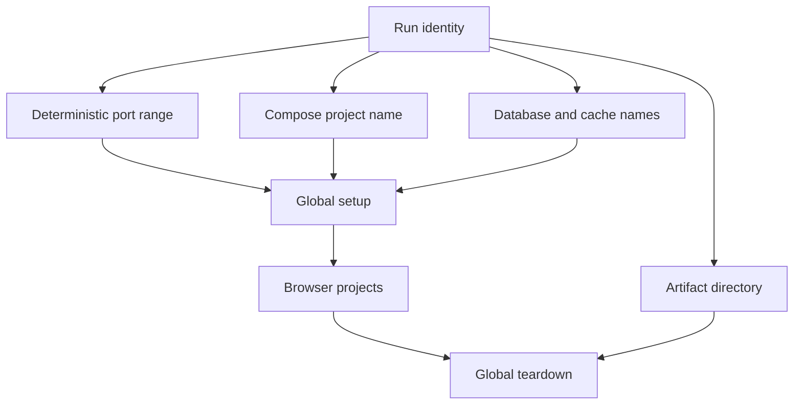

# Pattern: a parallel-safe browser-test harness

> **Status:** Implementation pattern · **Last verified:** 2026-08-31  
> **Use when:** browser suites may run concurrently on one host  
> **Goal:** make each run isolated, repeatable and diagnosable

## The problem

Parallel test runs compete for ports, container names, databases and temporary files. Choosing “any free port” reduces the first collision but does not give the run a stable identity or prevent later races.

Derive all shared resource names from one instance identity.



## One identity, one configuration source

Choose an instance identifier from stable CI context, such as the run and attempt. For local work, generate or accept an explicit identifier.

Map that identity deterministically to:

- application and supporting-service ports;
- the container-orchestration project name;
- database, schema or cache namespaces;
- temporary and artifact directories; and
- the base URL given to the browser runner.

Generate the connection configuration once. Setup, application processes and tests must read the same values. Recomputing ports in several scripts creates drift.

## Do not scan for a free port

A free-port scan has a time-of-check/time-of-use race: another process can claim the port after the scan. A deterministic allocation may still collide, but the collision is visible and reproducible.

If the derived resources are already in use by another live run, stop with could-not-assess. Do not attach to an unknown service.

## Own setup and teardown

Use project dependencies or global setup to bring the isolated environment up before browser projects start. Teardown should remove only resources carrying that run's validated identity.

Teardown must also run after test failure or cancellation where the runner allows it. Add periodic garbage collection for abandoned resources, but require strict labels and age limits so cleanup cannot affect live work.

## Prove isolation

Test at least these cases:

- two instances start at the same time;
- one instance fails during setup;
- one is cancelled during browser execution;
- stale resources exist from an earlier run;
- a chosen port or namespace is occupied by an unrelated process; and
- teardown runs twice.

The correct response to an ownership or collision doubt is could-not-assess, not reuse.

## Further reading

- [Playwright parallelism](https://playwright.dev/docs/test-parallel)
- [Playwright setup and teardown](https://playwright.dev/docs/test-global-setup-teardown)
- [Separate fast feedback from merge evidence](test-evidence-layers.md)

## Reference implementation

This example derives a repeatable instance number from CI identity, then uses it for every shared resource.

### Allocate resources once

```python
# scripts/e2e_instance.py
from __future__ import annotations

import argparse
import hashlib
import json
import os
import re
import sys

SAFE_ID = re.compile(r"^[A-Za-z0-9._-]{1,80}$")


def build(instance_id: str) -> dict[str, object]:
    if not SAFE_ID.fullmatch(instance_id):
        raise ValueError("instance id contains unsafe characters")

    digest = hashlib.sha256(instance_id.encode()).digest()
    slot = int.from_bytes(digest[:2], "big") % 400
    return {
        "instance_id": instance_id,
        "slot": slot,
        "app_port": 20000 + slot,
        "database_port": 21000 + slot,
        "compose_project": f"e2e_{slot}_{instance_id[:20]}",
        "artifact_dir": f"artifacts/e2e/{instance_id}",
    }


def main() -> int:
    parser = argparse.ArgumentParser()
    parser.add_argument("--instance", required=True)
    parser.add_argument("--output", required=True)
    args = parser.parse_args()

    try:
        config = build(args.instance)
        with open(args.output, "x", encoding="utf-8") as handle:
            json.dump(config, handle, indent=2)
    except (OSError, ValueError) as exc:
        print(f"could-not-assess: {exc}", file=sys.stderr)
        return 2

    print(json.dumps(config))
    return 0


if __name__ == "__main__":
    raise SystemExit(main())
```

Opening the output with `x` refuses accidental reuse within one workspace.

### Use the same values in Compose

```yaml
# compose.e2e.yml
services:
  db:
    image: postgres:17
    ports:
      - "${E2E_DATABASE_PORT}:5432"
    environment:
      POSTGRES_DB: e2e
      POSTGRES_USER: e2e
      POSTGRES_PASSWORD: local-e2e-only
    labels:
      test.instance: "${E2E_INSTANCE_ID}"

  app:
    build: .
    ports:
      - "${E2E_APP_PORT}:8000"
    environment:
      DATABASE_URL: postgresql://e2e:local-e2e-only@db:5432/e2e
    depends_on:
      - db
    labels:
      test.instance: "${E2E_INSTANCE_ID}"
```

Compose is invoked with the generated project name:

```bash
python scripts/e2e_instance.py   --instance "${GITHUB_RUN_ID:-local}-${GITHUB_RUN_ATTEMPT:-1}"   --output "$RUNNER_TEMP/e2e-instance.json"

eval "$(
  python - "$RUNNER_TEMP/e2e-instance.json" <<'PY'
import json, shlex, sys
c = json.load(open(sys.argv[1]))
for key, value in {
    "E2E_INSTANCE_ID": c["instance_id"],
    "E2E_APP_PORT": c["app_port"],
    "E2E_DATABASE_PORT": c["database_port"],
    "COMPOSE_PROJECT_NAME": c["compose_project"],
    "E2E_ARTIFACT_DIR": c["artifact_dir"],
}.items():
    print(f"export {key}={shlex.quote(str(value))}")
PY
)"

docker compose -f compose.e2e.yml up -d --wait
export E2E_BASE_URL="http://127.0.0.1:$E2E_APP_PORT"
npx playwright test --project=chromium
```

For a real repository, put the environment-export code in a reviewed script rather than leaving a multiline shell block in the workflow.

### Teardown by validated identity

```bash
#!/usr/bin/env bash
set -euo pipefail

case "${COMPOSE_PROJECT_NAME:-}" in
  e2e_[0-9]*_[A-Za-z0-9._-]*) ;;
  *)
    echo "could-not-assess: refusing unsafe project name" >&2
    exit 2
    ;;
esac

docker compose -f compose.e2e.yml down --volumes --remove-orphans
```

The validation is intentionally strict. Cleanup should fail safely rather than widen its target.

## Unit tests for allocation

```python
import pytest

from scripts.e2e_instance import build


def test_same_identity_gets_same_resources() -> None:
    assert build("run-42-attempt-1") == build("run-42-attempt-1")


def test_different_identity_changes_namespace() -> None:
    first = build("run-42-attempt-1")
    second = build("run-43-attempt-1")

    assert first["compose_project"] != second["compose_project"]
    assert first["artifact_dir"] != second["artifact_dir"]


@pytest.mark.parametrize("value", ["", "../shared", "a b", "x" * 81])
def test_unsafe_identity_is_rejected(value: str) -> None:
    with pytest.raises(ValueError):
        build(value)
```

A finite port range can still collide. Before startup, check whether a conflicting Compose project owns the derived ports. If ownership cannot be proved, report could-not-assess; never kill the unknown process.

## CI teardown

```yaml
- name: Start isolated environment
  run: scripts/e2e-up.sh
- name: Run browser tests
  run: npm run test:e2e:required
- name: Stop isolated environment
  if: always()
  run: scripts/e2e-down.sh
```

Also schedule a host-level garbage collector for abandoned resources. It should filter by an exact managed label and minimum age, produce a dry-run report first, and never use a broad Docker prune on a shared runner.
