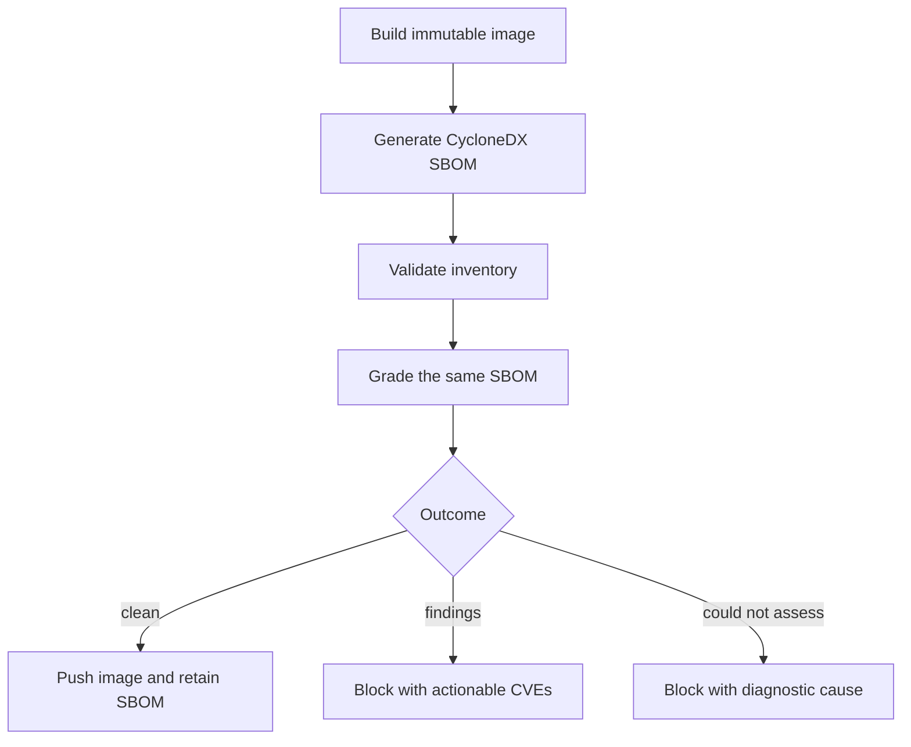

# Pattern: release SBOM and built-image scanning

> **Status:** Observed pattern · **Last verified:** 2026-08-31  
> **Enforcement:** release gate before registry push  
> **Reference implementation:** CycloneDX SBOM + digest-pinned image scanner

## Problem

Source manifests do not describe everything in a container image. They miss the
operating-system packages in the base image, and a manifest with version ranges
does not prove which versions were installed.

Scanning only the repository answers:

> What might this source build?

A release gate needs to answer:

> What is inside the image we are about to publish?

Generate the software bill of materials from the built image, scan that same
inventory, and keep it as release evidence.



## The load-bearing rules

### Scan the artifact that will ship

Build first, then point the scanner at the local image reference. Do not rebuild
between scanning and pushing. A second build may have a different base layer or
generated content even when the source commit is unchanged.

### Grade the SBOM you retain

Generate one CycloneDX document and use it as the input to the vulnerability
decision. This makes the retained inventory and the graded component set the
same set by construction.

### Keep three outcomes distinct

| Outcome | Meaning | Release action |
|---|---|---|
| clean | inventory was produced and no finding blocks under policy | continue |
| findings | inventory was produced and contains an actionable blocking vulnerability | stop |
| could not assess | scanner, database, parser or inventory failed | stop, but do not call it a vulnerability verdict |

A scanner exit code that conflates findings with execution failure is not enough.
Translate its report into your own small result vocabulary.

### The target must not choose its own gate

Run the scanner and waiver policy from the trusted workflow or base branch, not
from the commit being promoted. Otherwise a release candidate can weaken the
scanner that judges it.

### Empty evidence is not clean evidence

Refuse a missing, empty or implausibly small SBOM. A successful scanner process
that recognised no packages has not established a clean image.

## Minimal scanner wrapper

The example uses a containerised scanner pinned by digest. Substitute a current,
audited digest in your own repository.

```python
# scripts/scan_release_image.py
from __future__ import annotations

import json
import argparse
import subprocess
import sys
from dataclasses import dataclass
from pathlib import Path

SCANNER = "aquasec/trivy@sha256:<audited-digest>"
MIN_COMPONENTS = 25
BLOCKING = {"CRITICAL", "HIGH"}


class CouldNotAssess(RuntimeError):
    pass


@dataclass(frozen=True)
class Finding:
    vulnerability: str
    severity: str
    package: str
    installed: str
    fixed: str


def run(command: list[str], purpose: str) -> None:
    completed = subprocess.run(command, text=True, capture_output=True)
    if completed.returncode:
        detail = completed.stderr.strip() or completed.stdout.strip()
        raise CouldNotAssess(f"could not {purpose}: {detail or 'no diagnostic'}")


def component_count(sbom: Path) -> int:
    try:
        document = json.loads(sbom.read_text(encoding="utf-8"))
        components = document["components"]
    except (OSError, json.JSONDecodeError, KeyError, TypeError) as exc:
        raise CouldNotAssess(f"unreadable SBOM {sbom}: {exc}") from exc
    if not isinstance(components, list):
        raise CouldNotAssess("SBOM components is not a list")
    return len(components)


def validate_inventory(sbom: Path) -> int:
    count = component_count(sbom)
    if count < MIN_COMPONENTS:
        raise CouldNotAssess(
            f"SBOM contains only {count} components; expected at least {MIN_COMPONENTS}"
        )
    return count


def blocking_findings(report: Path) -> list[Finding]:
    try:
        document = json.loads(report.read_text(encoding="utf-8"))
        results = document["Results"]
    except (OSError, json.JSONDecodeError, KeyError, TypeError) as exc:
        raise CouldNotAssess(f"unreadable scan report {report}: {exc}") from exc

    if not isinstance(results, list):
        raise CouldNotAssess("scan Results is absent or not a list")

    findings: list[Finding] = []
    for result_index, result in enumerate(results):
        if not isinstance(result, dict):
            raise CouldNotAssess(f"Results[{result_index}] is not an object")
        vulnerabilities = result.get("Vulnerabilities", [])
        if vulnerabilities is None:
            raise CouldNotAssess(
                f"Results[{result_index}].Vulnerabilities is null"
            )
        if not isinstance(vulnerabilities, list):
            raise CouldNotAssess(
                f"Results[{result_index}].Vulnerabilities is not a list"
            )
        for item_index, item in enumerate(vulnerabilities):
            if not isinstance(item, dict):
                raise CouldNotAssess(
                    f"Results[{result_index}].Vulnerabilities[{item_index}] "
                    "is not an object"
                )
            severity = str(item.get("Severity", "UNKNOWN")).upper()
            fixed = str(item.get("FixedVersion") or "")
            if severity in BLOCKING and fixed:
                findings.append(
                    Finding(
                        vulnerability=str(item.get("VulnerabilityID", "unknown")),
                        severity=severity,
                        package=str(item.get("PkgName", "unknown")),
                        installed=str(item.get("InstalledVersion", "unknown")),
                        fixed=fixed,
                    )
                )
    return findings


def scan(image: str, sbom: Path, policy_dir: Path) -> int:
    out_dir = sbom.parent.resolve()
    out_dir.mkdir(parents=True, exist_ok=True)
    report = out_dir / f"{sbom.stem}.scan.json"
    mounts = [
        "-v", "/var/run/docker.sock:/var/run/docker.sock",
        "-v", f"{out_dir}:/out",
    ]

    run(
        ["docker", "run", "--rm", *mounts, SCANNER, "image", "--quiet",
         "--format", "cyclonedx", "--output", f"/out/{sbom.name}", image],
        f"generate the SBOM for {image}",
    )
    if not sbom.is_file() or sbom.stat().st_size == 0:
        raise CouldNotAssess(f"scanner wrote no SBOM for {image}")
    count = validate_inventory(sbom)

    ignore = policy_dir / ".trivyignore"
    policy_mount: list[str] = []
    ignore_args: list[str] = []
    if ignore.is_file():
        policy_mount = ["-v", f"{policy_dir.resolve()}:/policy:ro"]
        ignore_args = ["--ignorefile", "/policy/.trivyignore"]
    run(
        ["docker", "run", "--rm", *mounts, *policy_mount, SCANNER, "sbom",
         "--quiet", "--format", "json", "--output", f"/out/{report.name}",
         *ignore_args, f"/out/{sbom.name}"],
        f"grade the SBOM for {image}",
    )

    findings = blocking_findings(report)
    if findings:
        for item in findings:
            print(
                f"{item.vulnerability}: {item.severity} {item.package} "
                f"{item.installed} -> {item.fixed}"
            )
        return 1
    print(f"clean: {count} components inventoried for {image}")
    return 0


def main() -> int:
    parser = argparse.ArgumentParser()
    parser.add_argument("--image", required=True)
    parser.add_argument("--output", type=Path, required=True)
    parser.add_argument("--policy", type=Path, required=True)
    args = parser.parse_args()
    try:
        return scan(args.image, args.output, args.policy)
    except CouldNotAssess as exc:
        print(f"could-not-assess: {exc}", file=sys.stderr)
        return 2


if __name__ == "__main__":
    raise SystemExit(main())
```

The wrapper treats malformed nested data as `could not assess` by design.
An uncaught parser exception often exits with the same status used for findings,
which sends the operator hunting for a CVE that was never reported.

## Release workflow wiring

```yaml
- name: Stage trusted release policy
  run: |
    cp scripts/scan_release_image.py "$RUNNER_TEMP/scan_release_image.py"
    mkdir -p "$RUNNER_TEMP/scan-policy"
    if [ -f .trivyignore ]; then
      cp .trivyignore "$RUNNER_TEMP/scan-policy/.trivyignore"
    fi

- name: Check out release candidate
  run: git checkout --detach "$RELEASE_SHA"

- name: Build candidate image
  run: docker build --tag "app:${RELEASE_SHA}" .

- name: Generate and grade SBOM
  run: |
    python "$RUNNER_TEMP/scan_release_image.py" \
      --image "app:${RELEASE_SHA}" \
      --output "$RUNNER_TEMP/sbom/app-${RELEASE_SHA}.cdx.json" \
      --policy "$RUNNER_TEMP/scan-policy"

- name: Push only after a clean verdict
  run: docker push "registry.example/app:${RELEASE_SHA}"

- name: Retain SBOM
  uses: actions/upload-artifact@v4
  with:
    name: "sbom-${{ env.RELEASE_SHA }}"
    path: "${{ runner.temp }}/sbom/*.cdx.json"
```

For a tagged release, attach the SBOM to the release as well as retaining a CI
artifact. Include the immutable commit or image identity in the asset name. A
retry may replace evidence for the same identity; it must not overwrite evidence
for a different image that happened to share a version label.

## Make the policy actionable

One workable policy is:

| Finding | Action |
|---|---|
| critical/high with a fixed version | block and name the upgrade |
| critical/high with no fix available | report prominently; follow the declared risk policy |
| medium/low | count and retain for triage |
| unknown severity | could not assess unless the schema explicitly permits it |

The exact thresholds are a risk decision. The reusable part is that the policy
is explicit, testable and does not silently turn an unfixable queue into a gate
that everyone learns to override.

## Tests that earn confidence

Test the failure directions, not only a clean fixture:

```python
import pytest


def test_empty_inventory_is_not_clean(tmp_path):
    sbom = tmp_path / "sbom.json"
    sbom.write_text('{"components": []}')
    with pytest.raises(CouldNotAssess, match="only 0 components"):
        validate_inventory(sbom)


def test_fixable_high_is_blocking(tmp_path):
    report = tmp_path / "scan.json"
    report.write_text('''{
      "Results": [{"Vulnerabilities": [{
        "VulnerabilityID": "CVE-EXAMPLE",
        "Severity": "HIGH",
        "PkgName": "library",
        "InstalledVersion": "1.0",
        "FixedVersion": "1.1"
      }]}]
    }''')
    assert [item.vulnerability for item in blocking_findings(report)] == [
        "CVE-EXAMPLE"
    ]
```

Also cover:

- scanner image cannot be pulled;
- vulnerability database download fails;
- scanner exits without writing an SBOM;
- syntactically valid output contains `null` or malformed nested entries;
- component count falls below the plausibility floor;
- one of several images is unassessable;
- a retry of the same release identity is idempotent; and
- a different commit cannot overwrite an earlier SBOM asset.

## Limits

- An SBOM is an inventory, not proof that the image is benign.
- Vulnerability databases lag reality and can disagree.
- Component-count floors are plausibility checks, not completeness proofs.
- A scanner does not replace signing, provenance attestations or runtime controls.
- Waivers are control-plane code. Protect and review them like the gate itself.

## Related patterns

- [Layered security guidance](layered-security-guidance.md)
- [Three-outcome script contract](script-three-outcome-contract.md)
- [Review evidence bound to a commit](review-evidence-commit-binding.md)
