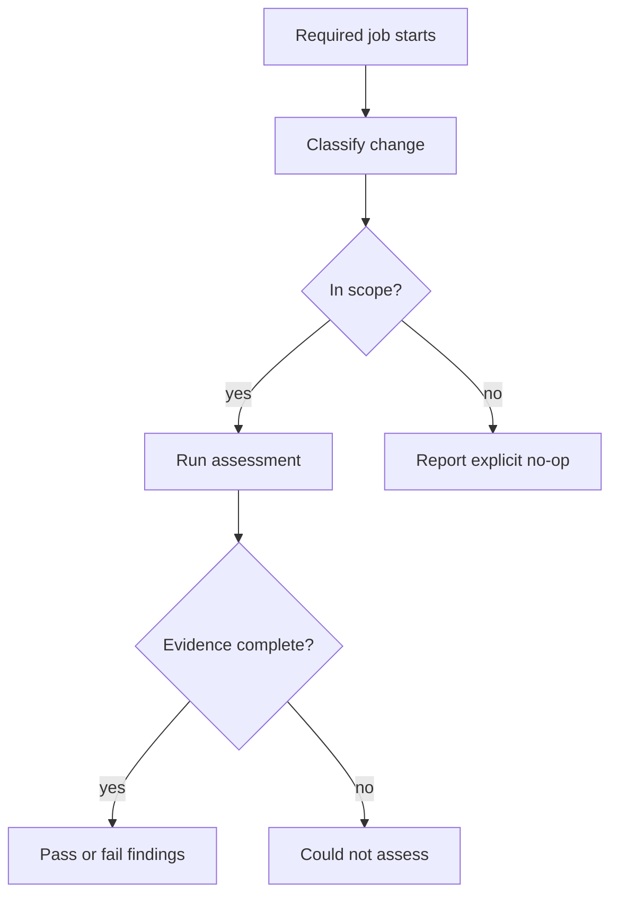

# Pattern: required checks should always report

> **Status:** Implementation pattern · **Last verified:** 2026-08-31  
> **Use when:** branch protection requires a CI job  
> **Goal:** avoid missing evidence hidden behind job-level conditions

## The problem

On GitHub Actions, a job skipped by a condition reports success and does not block merging. If that job is the required check, “it did not run” can look like approval.

Create the required job for every relevant event. Decide its scope inside the job.



## Recommended contract

The job should produce one of four honest reports:

| Report | Result |
|---|---|
| assessed: clean | success |
| assessed: findings | failure |
| not applicable: reason | success, with the reduced scope visible |
| could not assess: reason | failure |

Use stable required-check names for branch rules, and put the detailed scope in the job summary or a subordinate check. If separate required checks represent separate claims, keep their names stable too.

## Avoid job-level skipping

Do not put the main scope decision only in a job-level `if`. Start the job, validate inputs and calculate scope in a normal step. A no-op should be deliberate output, not an absence.

The classifier is part of the control. Test its positive, negative and uncertain branches. Unknown paths, malformed event data or diff-fetch failures should route to could-not-assess.

## Make diagnostics actionable

A failed check should name:

- what it tried to assess;
- the exact subject, such as the head commit;
- which step failed;
- whether it found a violation or lacked evidence; and
- the command or next action for a developer.

## Registration matters

A correct script provides no protection if the workflow never calls it or branch rules do not require its check. Test both the implementation and its wiring.

## Further reading

- [GitHub: conditions and skipped jobs](https://docs.github.com/actions/using-jobs/using-conditions-to-control-job-execution)
- [GitHub: status checks](https://docs.github.com/en/pull-requests/reference/status-checks)
- [The complete guardrail contract](complete-guardrail-contract.md)

## Reference implementation

This job always starts. A classifier writes a scope result, and later steps decide whether to assess, report a no-op or fail because scope is unknown.

### Scope classifier

```python
# scripts/classify_change.py
from __future__ import annotations

import argparse
import json
import sys
from pathlib import Path

BACKEND_PREFIXES = ("src/", "tests/", "pyproject.toml", "lockfile")


def classify(paths: list[str]) -> tuple[str, str]:
    if not paths:
        return "unknown", "the changed-file list is empty"

    if any(path.startswith(BACKEND_PREFIXES) for path in paths):
        return "assess", "backend-relevant files changed"

    return "not-applicable", "no backend-relevant files changed"


def main() -> int:
    parser = argparse.ArgumentParser()
    parser.add_argument("--changed-files", type=Path, required=True)
    parser.add_argument("--output", type=Path, required=True)
    args = parser.parse_args()

    try:
        paths = [
            line.strip()
            for line in args.changed_files.read_text().splitlines()
            if line.strip()
        ]
    except OSError as exc:
        print(f"could-not-assess: cannot read changed files: {exc}", file=sys.stderr)
        return 2

    verdict, reason = classify(paths)
    args.output.write_text(json.dumps({"verdict": verdict, "reason": reason}) + "\n")

    print(f"{verdict}: {reason}")
    return 2 if verdict == "unknown" else 0


if __name__ == "__main__":
    raise SystemExit(main())
```

An empty list is uncertain, not “no relevant files”.

### Always-created GitHub Actions job

```yaml
name: Backend evidence

on:
  pull_request:

jobs:
  backend-evidence:
    name: Backend evidence
    runs-on: ubuntu-latest
    permissions:
      contents: read
      pull-requests: read
    steps:
      - uses: actions/checkout@v4
        with:
          fetch-depth: 0

      - name: Collect changed files
        id: changes
        env:
          BASE_SHA: ${{ github.event.pull_request.base.sha }}
          HEAD_SHA: ${{ github.event.pull_request.head.sha }}
        run: |
          set -euo pipefail
          git diff --name-only "$BASE_SHA" "$HEAD_SHA"             > "$RUNNER_TEMP/changed-files.txt"

      - name: Classify scope
        id: scope
        run: |
          set +e
          python scripts/classify_change.py             --changed-files "$RUNNER_TEMP/changed-files.txt"             --output "$RUNNER_TEMP/scope.json"
          code=$?
          echo "exit_code=$code" >> "$GITHUB_OUTPUT"
          echo "verdict=$(jq -r .verdict "$RUNNER_TEMP/scope.json")"             >> "$GITHUB_OUTPUT"
          exit 0

      - name: Refuse unknown scope
        if: steps.scope.outputs.exit_code == '2'
        run: |
          echo "Could not assess backend scope" >&2
          exit 1

      - name: Run backend tests
        if: steps.scope.outputs.verdict == 'assess'
        run: python -m pytest

      - name: Report explicit no-op
        if: steps.scope.outputs.verdict == 'not-applicable'
        run: |
          echo "Backend tests not applicable: no backend files changed"             >> "$GITHUB_STEP_SUMMARY"
```

The shell keeps the classifier's exit code long enough to route it. It does not convert exit 2 into a successful assessment.

If your branch protection requires one stable check name, keep `Backend evidence` stable and put the detailed verdict in the summary. If your platform supports separate check runs safely, publish the scope as a subordinate result.

## Tests

```python
from scripts.classify_change import classify


def test_backend_file_requires_assessment() -> None:
    assert classify(["src/service.py"])[0] == "assess"


def test_docs_only_is_explicitly_not_applicable() -> None:
    assert classify(["docs/guide.md"])[0] == "not-applicable"


def test_empty_diff_is_unknown() -> None:
    assert classify([])[0] == "unknown"
```

## Workflow registration test

```python
from pathlib import Path


def test_required_job_has_no_job_level_if() -> None:
    import yaml

    workflow = yaml.safe_load(
        Path(".github/workflows/backend-evidence.yml").read_text()
    )
    job = workflow["jobs"]["backend-evidence"]

    assert "if" not in job
    commands = "\n".join(
        step.get("run", "") for step in job["steps"]
    )
    assert "classify_change.py" in commands
    assert "Could not assess backend scope" in commands
```

## Cases to exercise on a scratch pull request

- relevant source change: assessment runs;
- documentation-only change: explicit no-op is reported;
- base commit cannot be fetched: job fails;
- diff command fails: job fails before classification;
- empty changed-file file: unknown fails;
- classifier output is invalid JSON: routing fails; and
- workflow job is renamed: branch protection should show the required check as missing.

The final case proves that repository configuration is part of the guard.
