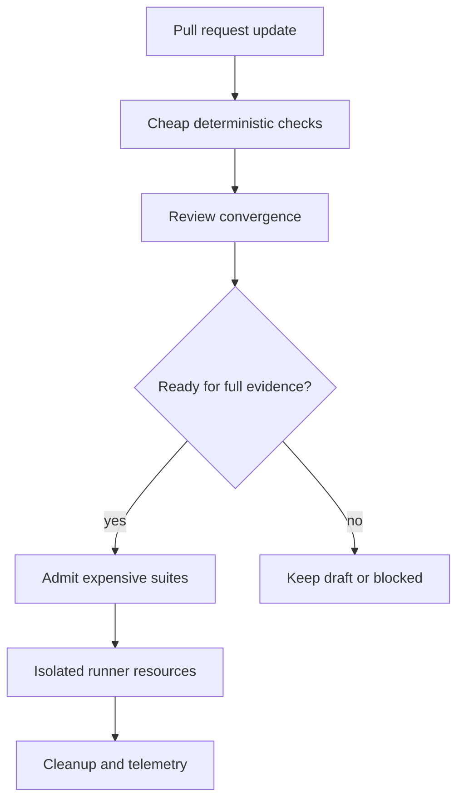

# Pattern: treat self-hosted runners as admitted capacity

> **Status:** Implementation pattern · **Last verified:** 2026-08-31  
> **Use when:** expensive CI runs on shared self-hosted machines  
> **Goal:** protect evidence quality while controlling queue pressure

## The problem

A self-hosted runner is both compute capacity and part of the CI trust boundary. Unbounded jobs, abandoned containers and ineffective cancellation can make a healthy repository look unreliable—or leave later jobs attached to stale resources.

## Admit work in stages



Run formatting, linting and narrow deterministic guards before scarce suites. Where review findings commonly cause another push, converge the review while the change is still a draft, then admit the full test workload when it is ready.

This is scheduling, not a reduction in evidence. Every required suite still runs before merge.

## Bound every job

Set explicit timeouts and concurrency groups. Cancellation saves capacity only if processes and containers actually stop, so test cancellation and teardown together.

Prefer one clear policy per workload:

- cancel superseded runs when cleanup is reliable;
- queue them when interruption would strand shared resources; or
- serialize a scarce environment when isolation is not yet safe.

## Isolate the workspace

Each run needs its own container project, ports, data namespaces, caches and artifact path. Never let a new job reuse a resource merely because it exists.

Caches should be treated as untrusted performance aids. Validate keys and make builds correct when the cache is absent.

## Maintain the runner

Monitor online state, queue time, disk, memory, container count and cleanup failures. Use targeted garbage collection based on validated labels and age. Do not use broad deletion against a shared host.

Keep the runner image and tools reproducible. A manual repair may restore service, but encode the repair before treating the platform as stable.

## Keep claims truthful

A capacity failure is could-not-assess. It is not a test pass and should not be converted into success to keep delivery moving.

## Further reading

- [GitHub: monitor and troubleshoot self-hosted runners](https://docs.github.com/actions/how-tos/managing-self-hosted-runners/monitoring-and-troubleshooting-self-hosted-runners)
- [Parallel-safe browser testing](parallel-safe-e2e-harness.md)
- [Required checks should always report](required-checks-always-report.md)

## Reference workflow

This example admits expensive tests only after cheap checks pass, isolates runs and cancels superseded work on the same pull request.

```yaml
name: Required CI

on:
  pull_request:
    types: [opened, synchronize, reopened, ready_for_review]

concurrency:
  group: required-ci-${{ github.event.pull_request.number }}
  cancel-in-progress: true

jobs:
  fast-checks:
    runs-on: [self-hosted, docker]
    timeout-minutes: 10
    steps:
      - uses: actions/checkout@v4
      - run: python -m ruff check .
      - run: python -m pytest tests/unit

  full-tests:
    needs: fast-checks
    if: github.event.pull_request.draft == false
    runs-on: [self-hosted, docker]
    timeout-minutes: 35
    env:
      RUN_INSTANCE: pr-${{ github.event.pull_request.number }}-${{ github.run_id }}-${{ github.run_attempt }}
    steps:
      - uses: actions/checkout@v4
      - name: Start isolated services
        run: scripts/ci-services-up.sh "$RUN_INSTANCE"
      - name: Run required suites
        run: scripts/ci-test.sh "$RUN_INSTANCE"
      - name: Collect diagnostics
        if: failure()
        run: scripts/ci-diagnostics.sh "$RUN_INSTANCE"
      - name: Remove isolated services
        if: always()
        run: scripts/ci-services-down.sh "$RUN_INSTANCE"
```

This workflow uses a draft condition on the expensive job. If `full-tests` itself is a required check, do not use this exact condition: create an always-reporting admission job or trigger full evidence only when the pull request becomes ready. A skipped required job is not honest merge evidence.

## Safe resource labels

Every container and volume should carry enough ownership data to distinguish a live run from abandoned state.

```yaml
services:
  app:
    labels:
      managed-by: "ci-harness"
      ci.instance: "${RUN_INSTANCE}"
      ci.created-at: "${RUN_CREATED_AT}"
  database:
    labels:
      managed-by: "ci-harness"
      ci.instance: "${RUN_INSTANCE}"
      ci.created-at: "${RUN_CREATED_AT}"
```

Use a unique Compose project name derived from the same instance identity.

## Targeted garbage collection

```python
# scripts/runner_gc.py
from __future__ import annotations

import datetime as dt
import json
import subprocess
import sys

MANAGED_LABEL = "managed-by=ci-harness"
MINIMUM_AGE = dt.timedelta(hours=6)


def candidates(now: dt.datetime) -> list[str]:
    completed = subprocess.run(
        [
            "docker", "ps", "-a",
            "--filter", f"label={MANAGED_LABEL}",
            "--format", "{{json .}}",
        ],
        check=False,
        capture_output=True,
        text=True,
    )
    if completed.returncode != 0:
        raise RuntimeError(completed.stderr.strip())

    result: list[str] = []
    for line in completed.stdout.splitlines():
        row = json.loads(line)
        created = dt.datetime.fromisoformat(
            row["CreatedAt"].replace(" +0000 UTC", "+00:00")
        )
        if now - created >= MINIMUM_AGE:
            result.append(row["ID"])
    return result


def main() -> int:
    try:
        stale = candidates(dt.datetime.now(dt.timezone.utc))
    except (OSError, RuntimeError, ValueError, json.JSONDecodeError) as exc:
        print(f"could-not-assess: {exc}", file=sys.stderr)
        return 2

    for container_id in stale:
        print(container_id)
    return 0


if __name__ == "__main__":
    raise SystemExit(main())
```

Make dry-run the default. A separate, reviewed `--delete` option can remove exactly the printed identifiers after rechecking their labels and age. Never replace this with `docker system prune -af` on a shared runner.

## Admission metrics

Record at least:

| Metric | Why |
|---|---|
| queue wait by job class | shows whether scarce suites are saturated |
| runtime and timeout count | finds under-sized timeout policy or stuck jobs |
| cancellation-to-process-exit time | proves cancellation actually frees capacity |
| stale resources found | shows cleanup reliability |
| disk and inode use | catches runner degradation before jobs fail |
| could-not-assess count | keeps infrastructure failure separate from test failure |

## Cancellation test

Use a scratch branch to start a long-running container, then push another commit. Verify:

1. the first workflow becomes cancelled;
2. its process exits;
3. its labelled containers and volumes are removed;
4. the second run gets a fresh namespace; and
5. the required result belongs to the latest head SHA.

A cancelled GitHub run with a still-running container has not freed capacity. It has merely stopped reporting.

## Host recovery test

Take one runner offline while work is queued. The system should show unavailable capacity and eventually route to could-not-assess or another eligible runner. It must not mark required evidence as clean because no machine accepted the job.

Keep the runner image, Docker version and browser dependencies reproducible. Record manual repairs as changes to the image or provisioning code, otherwise the next rebuild quietly brings the fault back.
