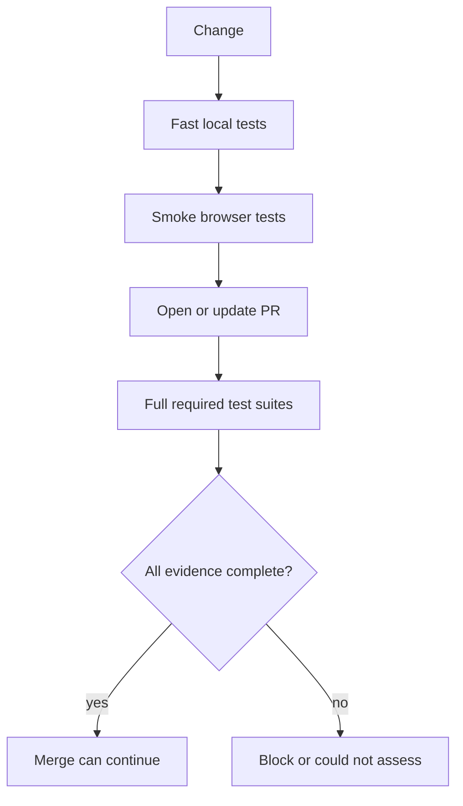

# Pattern: separate fast feedback from merge evidence

> **Status:** Implementation pattern · **Last verified:** 2026-08-31  
> **Use when:** a project has unit, integration and browser tests  
> **Goal:** keep local feedback fast without overstating what CI proved

## The problem

A smoke suite answers “is the main path obviously broken?” It does not answer “is this change safe to merge?” The distinction matters when agents choose tests based on a diff: a green subset can look convincing while the omitted test is the one that would fail.

## Give each test layer a claim

| Layer | Main purpose | Suitable merge claim |
|---|---|---|
| Unit | fast logic feedback | the tested units behave as specified |
| Component or integration | boundaries inside the application | the tested components work together |
| Acceptance | business behaviour | the named acceptance examples pass |
| Browser smoke | quick local confidence | selected critical paths start and respond |
| Full browser suite | cross-browser and end-to-end evidence | every configured browser project completed |



## The rule

Use the smallest useful tests while developing. Run the complete required suites before merge.

Risk-based selection can add fast feedback, but it should not silently replace a required suite. If you deliberately narrow merge evidence, state the reduced claim in the check name and keep a safe fallback for uncertain classification.

## Why we stopped using a smoke-only merge path

In the system this pattern came from, a selected browser subset passed while relevant tests outside the subset would have failed. The selector had produced a green result, not complete evidence.

The response was simple:

- keep smoke tests for local use;
- run every configured browser project in required CI;
- treat collection failures and missing projects as could-not-assess; and
- report the scope in the check name.

## Check the test harness too

A test command can exit successfully after collecting fewer tests than expected. Record a minimum collection floor or an expected project list where stable. Fail clearly when configuration, discovery or setup removes evidence.

## Practical defaults

- Keep smoke cases few, stable and representative.
- Do not duplicate full-suite assertions in the smoke suite.
- Make full-suite timeouts explicit.
- Upload traces and reports on failure.
- Measure flaky retries separately; a retry is not the same evidence as a first-pass success.
- Keep test data and service instances isolated between concurrent runs.

## Further reading

- [Playwright parallelism](https://playwright.dev/docs/test-parallel)
- [Playwright setup and teardown](https://playwright.dev/docs/test-global-setup-teardown)
- [Parallel-safe browser testing](parallel-safe-e2e-harness.md)

## Reference implementation with Playwright

The key is to make the local smoke command and the required CI command visibly different.

### Playwright projects

```typescript
// playwright.config.ts
import { defineConfig, devices } from "@playwright/test";

export default defineConfig({
  testDir: "./e2e",
  fullyParallel: true,
  retries: process.env.CI ? 1 : 0,
  reporter: process.env.CI
    ? [["html", { open: "never" }], ["line"]]
    : "list",
  use: {
    baseURL: process.env.E2E_BASE_URL,
    trace: "retain-on-failure",
  },
  projects: [
    {
      name: "smoke",
      grep: /@smoke/,
      use: { ...devices["Desktop Chrome"] },
    },
    {
      name: "chromium",
      grepInvert: /@smoke-only/,
      use: { ...devices["Desktop Chrome"] },
    },
    {
      name: "firefox",
      grepInvert: /@smoke-only/,
      use: { ...devices["Desktop Firefox"] },
    },
  ],
});
```

The smoke project is a developer shortcut. CI names the complete projects explicitly, so adding a convenience project cannot silently change merge evidence.

### Package scripts

```json
{
  "scripts": {
    "test:e2e:smoke": "playwright test --project=smoke",
    "test:e2e:required": "playwright test --project=chromium --project=firefox",
    "test:e2e:list": "playwright test --list"
  }
}
```

### Required CI job

```yaml
name: Browser evidence

on:
  pull_request:

jobs:
  full-browser-suite:
    name: Full browser suite (chromium + firefox)
    runs-on: ubuntu-latest
    timeout-minutes: 30
    steps:
      - uses: actions/checkout@v4
      - uses: actions/setup-node@v4
        with:
          node-version: 22
          cache: npm
      - run: npm ci
      - run: npx playwright install --with-deps chromium firefox
      - run: npm run test:e2e:required
        env:
          E2E_BASE_URL: http://127.0.0.1:4173
      - if: failure()
        uses: actions/upload-artifact@v4
        with:
          name: playwright-report
          path: playwright-report/
```

Do not make the required job call `test:e2e:smoke`, even on a “small” diff, unless the branch rule and check name explicitly accept that reduced claim.

## Collection-floor check

Playwright can list tests without executing them. A small script can verify that every required project is present and that collection has not fallen below a reviewed floor.

```python
# scripts/check_playwright_collection.py
from __future__ import annotations

import json
import subprocess
import sys

REQUIRED_PROJECTS = {"chromium", "firefox"}
MINIMUM_TESTS_PER_PROJECT = 12


def collect() -> dict[str, int]:
    completed = subprocess.run(
        ["npx", "playwright", "test", "--list", "--reporter=json"],
        check=False,
        text=True,
        capture_output=True,
    )
    if completed.returncode != 0:
        raise RuntimeError(completed.stderr.strip() or "collection command failed")

    payload = json.loads(completed.stdout)
    counts: dict[str, int] = {}

    def visit(suite: dict[str, object]) -> None:
        for spec in suite.get("specs", []):
            for test in spec.get("tests", []):
                project = test.get("projectName")
                if project:
                    counts[project] = counts.get(project, 0) + 1
        for child in suite.get("suites", []):
            visit(child)

    for suite in payload.get("suites", []):
        visit(suite)
    return counts


def main() -> int:
    try:
        counts = collect()
    except (OSError, RuntimeError, json.JSONDecodeError) as exc:
        print(f"could-not-assess: {exc}", file=sys.stderr)
        return 2

    missing = REQUIRED_PROJECTS - counts.keys()
    below = {
        project: counts.get(project, 0)
        for project in REQUIRED_PROJECTS
        if counts.get(project, 0) < MINIMUM_TESTS_PER_PROJECT
    }
    if missing or below:
        print(f"findings: missing={sorted(missing)} below_floor={below}")
        return 1

    print(f"clean: collected {counts}")
    return 0


if __name__ == "__main__":
    raise SystemExit(main())
```

Pin the floor to a reviewed baseline and raise it when tests are added. Do not automatically lower it when collection falls.

## Example smoke test

```typescript
import { test, expect } from "@playwright/test";

test("signed-in landing page is available @smoke", async ({ page }) => {
  await page.goto("/");
  await expect(page.getByRole("heading", { name: "Dashboard" })).toBeVisible();
});
```

A smoke test should prove that a critical path starts. Detailed validation stays in the full suite.

## Failure-path tests

Test the harness itself:

- remove one configured project and confirm the collection check fails;
- introduce a syntax error and confirm the result is could-not-assess;
- collect fewer tests than the floor and confirm it is a finding;
- make a browser test flaky and confirm retries are visible;
- cancel a run and confirm it is not reported as passed; and
- run the smoke script locally and confirm its output never claims full-suite evidence.
